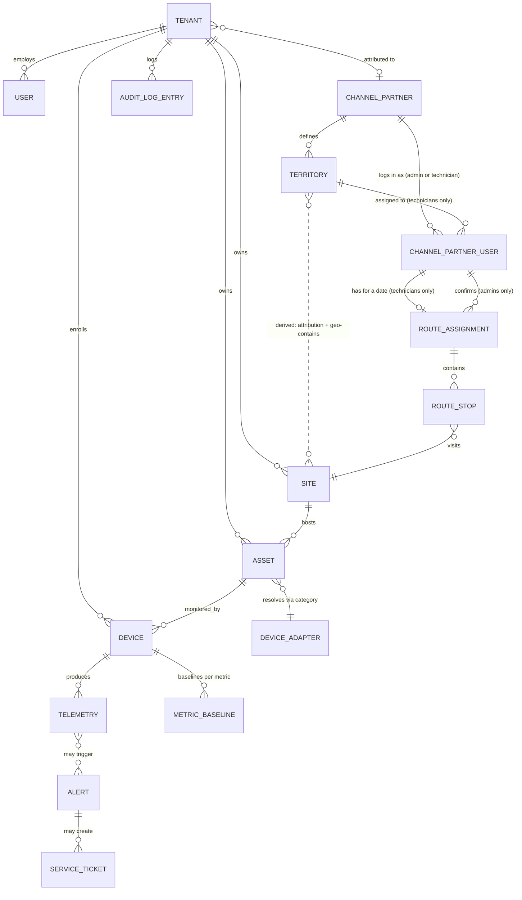

# Domain Model

**Product:** PeakView Hub / PeakView 360
**Cloud Platform:** PeakLogicSystems
**Project Codename:** Vantage
**Status:** Draft v1.1 (amendment pending review/approval — see Revision History, end of document; base document remains Approved v1 until v1.1 is approved)
**Depends on:** [Vision Document](vision-document.md) (approved v1), [PRD](prd.md) (approved v1.5), [SRS](srs.md) (approved v1.5)
**Last updated:** 2026-07-11

---

## 1. Introduction

### 1.1 Purpose

The SRS specifies *how the system must behave*; it deliberately stops short of naming the actual entities and relationships behind that behavior (SRS §6, §2.6). This document formalizes them: the nouns of the system, the facts each one holds, and how they relate. It is the input to the Database Schema (#10) and API Specification (#11), but it is not itself a schema — no column types, indexes, or storage engine decisions live here.

**This project differs from a from-scratch domain model in one important way**: most of these entities already exist as real tables in `docs/data-model.sql`. This document formalizes what's there, reconciles it against the SRS, and calls out — explicitly, in §6 — anywhere the SRS's new requirements (device adapters, baseline analytics, channel partners) need something the existing schema doesn't have yet.

### 1.2 Scope

In scope: the entities needed to support every SRS §3 feature area (Device Adapter Framework, Sensing Modalities, Alerting, Device Management, Multi-Tenancy, Device & Command Networking, AI & MCP, Channel & Partner Support, Auth, Audit) at the MVP horizon.

Out of scope: exact column types/constraints (→ Database Schema, #10), API request/response shapes (→ API Specification, #11), pool-chemistry/gas-sensor threshold *content* (→ still unassigned, SRS Open Issue #1 — this document only models the *shape* an adapter's rules take, not their values).

### 1.3 Notation

- Entities are named in `PascalCase` and described in a table of key attributes (not exhaustive — only attributes that matter conceptually or are already named in the SRS/existing schema).
- Relationships use standard crow's-foot-style cardinality in prose: **1—1**, **1—***, ***—***, with **0..** prefixes where a relationship is optional.
- "Existing" marks an entity/attribute already present in `docs/data-model.sql`, kept as-is. "New" marks something this SRS's requirements need that isn't in the current schema yet.
- "Derived" marks a value that must never be stored as an independently-mutable field — computed by querying another entity's history instead, following the same principle IronQuill's Domain Model established for its own event-sourced state.

---

## 2. Core Entities

### 2.1 Tenancy & Identity

**Tenant** *(existing)* — an isolated customer organization. Everything else is tenant-scoped, directly or transitively, enforced structurally via Postgres RLS (MT-1.1).
| Attribute | Notes |
|---|---|
| tenant_id | |
| name, slug | |
| plan | trial / starter / professional / enterprise |
| status | active / suspended / trial |
| settings (JSONB) | Includes `webhook_url` (existing) |
| **channel_partner_id (nullable)** | **New** — attributes this tenant to a reseller relationship (CH-1.1) |

**User** *(existing)* — a person who can authenticate and act in the system.
| Attribute | Notes |
|---|---|
| user_id, cognito_sub, email, display_name | |
| role | Existing enum `admin` / `operator` / `service_partner`. **Naming reconciliation**: these map to the PRD/SRS's Tenant Admin / Facility Operator / Service Partner respectively — same values, no schema change, just the display names used in product docs going forward |
| status | |

**ChannelPartner** *(new)* — a reseller/supplier relationship (e.g. a pool-chemical supplier) whose customers' tenants are attributed to them (CH-1.1, CH-2.1).
| Attribute | Notes |
|---|---|
| channel_partner_id | |
| name | |
| contact_info | |
| branding (JSONB, nullable) | **New, added v1.1** — `logo_url`, `primary_color`, `secondary_color` for the white-label portal login (CH-3.1, §2.7). Null for a channel partner that's attribution-only (CH-1/CH-2, every vertical except pool-servicing) — branding only applies once a partner is onboarded to the portal |

A Tenant has **0..1** ChannelPartner (a tenant may or may not have come through a channel relationship); a ChannelPartner has **many** Tenants (CH-2.1's attribution report groups by this relationship).

### 2.2 Facilities & Assets

**Site** *(existing)* — a physical location (a restaurant, a nursing home, a pumping station).
| Attribute | Notes |
|---|---|
| site_id, tenant_id, name | |
| type | Broadened enum: `pumping_station`, `qsr`, `restaurant`, `pool`, `nursing_home`, `retail`, `light_industrial`, `multifamily_residential`, `other` |
| address, lat/lng, timezone, metadata | |

**Asset** *(existing)* — a piece of equipment at a Site being monitored (a pump, a walk-in cooler, a pool pump).
| Attribute | Notes |
|---|---|
| asset_id, tenant_id, site_id, name | |
| category | Free text — existing values `pump`, `hvac`, `pool_system`, `refrigeration`, `leak_sensor`, `energy_meter`; **new** values needed per SRS §3.2: `pool_chemistry`, `gas_sensor`, `air_quality` |
| make, model, serial_number, install_date | |
| specs (JSONB) | Manually entered; consumed by a Device Adapter's threshold functions (DA-2.1) |
| health_status | healthy / warning / critical / offline / unknown |

An Asset's `category` is the join point to exactly one **DeviceAdapter** (§2.3) — this is a resolution rule, not a stored foreign key, mirroring how IronQuill's JurisdictionConfig resolves to a ReferenceDataset by rule rather than a hard reference.

### 2.3 Devices & Adapters

**Device** *(existing)* — a physical IoT device identity, distinct from the Asset it monitors.
| Attribute | Notes |
|---|---|
| device_id, tenant_id, serial, thing_name | `thing_name` is the AWS IoT Core identity |
| asset_id (nullable) | A Device links to **0..1** Asset; an Asset may have **many** Devices (e.g. a walk-in cooler asset could carry both a temperature-probe device and a separate leak-sensor device) |
| firmware_version, status, last_seen_at, provisioned_at | |

**DeviceAdapter** *(new — conceptual entity, not necessarily its own database table at MVP)* — the contract a sensing modality plugs into (DA-1.1, DA-2.1). At MVP this is a **code-defined object** (formalizing `RULES_BY_CATEGORY` in `backend/ingest/handler.ts`), not a database row — per DA-3.1, adapters are code-deployed, not dynamically registered. It is modeled here because it's a real conceptual entity the system reasons about, even though its MVP storage location is source code rather than a table.
| Attribute | Notes |
|---|---|
| category (key) | Matches Asset.category |
| declared_metrics | Names + units this adapter expects (DA-2.1) |
| threshold_rules | metric, condition, threshold (static or specs-derived), severity, message |
| default_specs | Used when an Asset's `specs` are unset |

**MetricBaseline** *(new)* — a maintained, per-device-per-metric rolling statistical baseline (trailing-window mean/standard-deviation) supporting AI-3.1's anomaly detection. Modeled as a maintained entity (updated incrementally as telemetry arrives) rather than recomputed from scratch on every reading, for performance — flagged as a recommendation, not a settled decision, in §6.
| Attribute | Notes |
|---|---|
| device_id, metric, tenant_id | tenant_id denormalized, same rationale as §4.1 |
| trailing_mean, trailing_stddev | |
| window_start, window_end | |
| sample_count | Used to withhold a flag until a minimum history threshold is met (SRS §3.7 error condition) |

### 2.4 Telemetry & Alerting

**Telemetry** *(existing)* — a single timestamped reading from a Device.
| Attribute | Notes |
|---|---|
| time, device_id, tenant_id, metric, value, quality | |

A Telemetry row is evaluated against its Device's Asset's DeviceAdapter (§2.3) at ingest time, and separately against its MetricBaseline (§2.3), producing zero or more Alerts.

**Alert** *(existing, extended)* — a record produced when a telemetry value trips a rule.
| Attribute | Notes |
|---|---|
| alert_id, tenant_id, device_id, asset_id | |
| severity | info / warning / critical |
| type | Existing value `threshold`; **new** value `trend` or `anomaly` needed for AI-3.2, so a baseline-deviation flag is distinguishable from a static-threshold alert |
| message, context (JSONB) | |
| status | open / acknowledged / resolved / suppressed |
| triggered_at, acknowledged_at, resolved_at | |

**ServiceTicket** *(existing)* — auto-created for critical Alerts, or manually.
| Attribute | Notes |
|---|---|
| ticket_id, tenant_id, alert_id (nullable), asset_id, assigned_to | |
| title, description, priority, status | |
| webhook_url, external_ref, due_at, resolved_at | |

An Alert has **0..*** ServiceTickets (existing FK is nullable, not unique — in practice, MVP behavior (AL-2.1) creates exactly one per critical Alert).

### 2.5 AI & MCP — no new entities

The MCP server (MCP-1.1) and baseline analytics (AI-3.1) are an **access/computation layer over existing entities** (Device, Alert, Telemetry, MetricBaseline) — not a new domain concept requiring its own entity beyond MetricBaseline (§2.3). This is called out explicitly so the Database Schema and API Specification artifacts don't go looking for an "MCP entity" that isn't there by design.

### 2.6 Audit

**AuditLogEntry** *(new)* — a record of a state-changing administrative action (AUD-1).
| Attribute | Notes |
|---|---|
| audit_log_id, tenant_id | Tenant-scoped, same RLS enforcement as every other table (AUD-2) |
| actor (user_id) | |
| action, target_entity, target_id | |
| prior_value, new_value (nullable) | |
| timestamp | |

### 2.7 Channel Partner Portal & Dispatch *(new — added v1.1, see Revision History)*

For the pool-servicing vertical specifically — the entities behind the scoped operational-dispatch portal (CH-3.1) and territory/route management (TR-1.1–TR-3.2). None of this existed in `docs/data-model.sql` before this amendment.

**ChannelPartnerUser** *(new)* — a person who can authenticate into a channel partner's portal (CH-3.1): either a partner-side admin/dispatcher, or a technician. A genuinely new identity surface, not an extension of `User` — a channel partner is not a Tenant, so this is deliberately a separate table/identity space (§4 decision 6).
| Attribute | Notes |
|---|---|
| channel_partner_user_id, channel_partner_id | |
| cognito_sub, email, display_name | Same shape as `User`, different identity space |
| role | `partner_admin` (sees/manages across all the partner's territories) or `technician` (see access-scoping note below) — mirrors `User.role`'s existing single-entity, role-differentiated pattern (§4 decision 5) rather than inventing a separate Technician table *(changed v1.1 during review — see §6.4/Revision History; earlier draft modeled Technician as a separate, login-less entity)* |
| territory_id (nullable) | **0..1** — only meaningful for `role = technician`: the technician's assigned territory. Null for `partner_admin`, or a technician not yet assigned (SRS §3.12 error condition) |

**A `technician`-role ChannelPartnerUser's access is scoped to their assigned territory's sites only** — they can authenticate, but the only Sites/Assets/telemetry readings visible to them are the ones a `TR-2.1` territory assignment already resolves as theirs (§4 decision 6's Territory→Site rule), not every Site attributed to the channel partner. A `partner_admin` has no such restriction. This is the access-control shape (Security Architecture, #13, still owns the concrete enforcement mechanism) — modeled here because it directly follows from the territory assignment already being domain structure, not a new concept.

**Provisioning is `partner_admin`-initiated, not self-service**, for either role: a `partner_admin` creates a technician's login credential and assigns their territory (their "preconfigured assets") and routes — no self-service signup path exists for a channel partner's own portal at MVP. Mirrors CH-1.2's existing internal-assignment-only precedent (a tenant can't self-assign its own channel-partner attribution either); the same "assignment is controlled by whoever has administrative authority over the relationship, not the assignee" principle, applied here at the partner-admin/technician level instead of the PeakLogic/tenant level.

**Territory** *(new)* — a named geographic boundary a channel partner defines to group technician assignments (TR-1.1).
| Attribute | Notes |
|---|---|
| territory_id, channel_partner_id, name | |
| boundary | A geographic polygon. Exact storage type (PostGIS `geography`/`geometry` vs. a JSONB GeoJSON blob) is Database Schema's decision (§5) — `docs/data-model.sql` already has an unused `postgis` extension installed, a strong hint toward finally using it rather than reinventing polygon math in JSONB |

A Territory's Site membership is **derived, not stored** (§1.3 notation): a Site belongs to a Territory if (a) the Site's Tenant is attributed to the Territory's ChannelPartner (existing `Tenant.channel_partner_id`) and (b) the Site's `lat`/`lng` fall within the Territory's `boundary`. No `territory_id` column exists on `Site` — this mirrors the Asset→DeviceAdapter resolution-by-rule pattern (§4 decision 4), not a new precedent. **This derived set is also a technician's "preconfigured assets"** — the exact scoping boundary for their limited portal access, above.

**RouteAssignment** *(new)* — a technician's (`ChannelPartnerUser.role = technician`) suggested-or-confirmed route for one calendar day (TR-3.1, TR-3.2). Distinct from RP-2.1's live-computed urgency list: RP-2.1 is a plain, always-fresh query with no persisted state, but a route the AI has suggested (or a partner has confirmed) must stay stable through the day even as underlying alert/telemetry data keeps changing — that requires a real stored snapshot, not a re-derivable view.
| Attribute | Notes |
|---|---|
| route_assignment_id, technician_user_id, route_date | **1** RouteAssignment per (technician, date). `technician_user_id` references `ChannelPartnerUser` (expected `role = technician`, a data-integrity expectation not a distinct FK type — same category of soft constraint as `Asset.category`↔`DeviceAdapter`) |
| source | `ai_suggested` (produced by the external agent via MCP, TR-3.1) or `manual` — a `partner_admin` may build or edit a technician's route by hand instead of relying on the AI suggestion (e.g. the external agent is unreachable, per SRS §3.12's error condition, or the admin simply prefers to). TR-3.2's "no in-house routing algorithm" constraint is about who computes an *ordering*, not a restriction on manual assignment |
| status | `suggested` or `confirmed` (a `partner_admin` ChannelPartnerUser has reviewed and accepted it) — applies regardless of `source`; a manually-built route still goes through the same confirmation gate as an AI-suggested one |
| confirmed_by (channel_partner_user_id, nullable), confirmed_at (nullable) | Null until `status` transitions to `confirmed` — TR-3.1's "advisory only" requirement modeled as an explicit confirmation gate, not just a status label. Expected `role = partner_admin`, same soft-constraint pattern as above |
| generated_at | |

**RouteStop** *(new)* — one ordered stop within a RouteAssignment.
| Attribute | Notes |
|---|---|
| route_stop_id, route_assignment_id, site_id | |
| sequence_number | The AI-suggested (or partner-adjusted) visit order |

A RouteAssignment has **1—*** RouteStops, each referencing exactly **1** Site. A RouteStop's per-site readings (chemistry, alert status) are **not stored here** — queried live from the same Telemetry/Alert chain RP-2.1 already uses (Site→Asset→Device→Telemetry), the same "don't duplicate what's derivable" principle applied everywhere else in this document except MetricBaseline (§4 decision 3's caching rationale doesn't apply to a once-daily route view).

**Cardinalities:** A ChannelPartner has **many** ChannelPartnerUsers (of either role) and **many** Territories. A Territory has **0..*** ChannelPartnerUsers with `role = technician` assigned to it. A technician-role ChannelPartnerUser has **0..1** RouteAssignment per calendar date.

---

## 3. Relationship Diagram

---

## 4. Key Modeling Decisions & Rationale

1. **`tenant_id` is denormalized onto every tenant-scoped table** (Telemetry, Alert, ServiceTicket, and the new MetricBaseline/ChannelPartner/AuditLogEntry) even though it's derivable via joins in most cases — this is the existing schema's own established pattern (`docs/data-model.sql`'s RLS policies all key on a directly-present `tenant_id`), continued here for the same reason IronQuill denormalized tenant_id onto LedgerEvent: structural tenant isolation (MT-1.1) should never depend on a join succeeding correctly.
2. **DeviceAdapter is modeled as a real conceptual entity despite being code, not a database row, at MVP.** DA-3.1 is explicit that adapters are code-deployed for MVP — but the *shape* of an adapter (declared metrics, threshold rules, default specs) is real domain structure the system depends on, so it's documented here rather than treated as invisible implementation detail. When a self-service adapter marketplace is eventually built (explicitly out of MVP scope), this entity is the one that needs to move from code into a real table — this document is that future work's starting reference.
3. **MetricBaseline is a maintained entity, not a derived live-query**, unlike IronQuill's strict "always derive, never store mutable state" rule for status-like fields. This is a deliberate difference, not an inconsistency: a rolling statistical baseline over potentially high-volume telemetry is expensive to recompute from raw data on every reading, and unlike a "current assignee" or "completion status" (which represent authoritative state that must never silently diverge from its source events), a baseline is a *derived statistic* that's expected to be periodically recomputed/refreshed — storing it is a caching decision, not a risk to data integrity.
4. **Asset→DeviceAdapter is a resolution rule keyed on `category`, not a foreign key** — consistent with how IronQuill's JurisdictionConfig resolves to a ReferenceDataset by rule. This keeps `assets.category` free-text and adapter-agnostic at the schema level (no migration needed to add a new adapter), matching DA-1.1's requirement that new modalities not require core changes.
5. **User role naming is reconciled, not changed.** The existing `admin`/`operator`/`service_partner` enum values are kept; Tenant Admin/Facility Operator/Service Partner are the product-facing names used in the PRD/SRS/Vision going forward. No migration required.
6. **Channel-partner-scoped entities (§2.7) introduce a second scoping dimension alongside `tenant_id` — added v1.1.** Every entity before this amendment is scoped by exactly one `tenant_id`, enforced structurally by RLS (decision 1). ChannelPartnerUser, Territory, RouteAssignment, and RouteStop are scoped by `channel_partner_id` instead — and a RouteAssignment's stops can reference Sites belonging to *multiple different tenants* (every tenant attributed to that channel partner), which no existing entity in this schema does. **Flagged, not resolved, here**: the concrete RLS/access-control mechanism for this new scoping dimension is Multi-Tenant Architecture's (#14) job to amend; ChannelPartnerUser's concrete auth mechanism is Security Architecture's (#13). Modeled now so those two artifacts have a concrete shape to design against.
7. **Territory→Site is a derived resolution rule (geographic containment + existing tenant attribution), not a stored foreign key — added v1.1.** Consistent with decision 4's Asset→DeviceAdapter precedent. Keeps `sites` schema-stable as territories are redrawn — a territory boundary edit never requires a bulk `UPDATE sites`.
8. **Technician and partner-admin are both `ChannelPartnerUser` roles, not separate entities — added v1.1, resolved during review (§6.4).** Mirrors `User.role`'s existing single-entity, role-differentiated pattern (decision 5) rather than a Field-Service-Partner-style no-login design. **User decision, 2026-07-11: technicians get real logins, but access is scoped to their assigned territory's sites only** (§2.7) — not full portal access, consistent with the "operational dispatch view only" scope already locked for CH-3 overall. **Provisioning is admin-initiated, not self-service**: a `partner_admin` creates a technician's login credential and assigns their territory (preconfigured assets) and routes — mirrors CH-1.2's existing internal-assignment-only precedent (a tenant can't self-assign its own channel-partner reference either). No self-service signup path exists for either role at MVP.

---

## 5. What This Document Does Not Decide

- Exact column types, constraints, indexing for any entity above — Database Schema (#10).
- Request/response payload shapes, including the MCP server's exact tool schema — API Specification (#11).
- Pool-chemistry and gas-sensor threshold *content* (the actual numbers) — still unassigned per SRS Open Issue #1; this document only models the shape a DeviceAdapter's `threshold_rules` take.
- Actuation/command entities (e.g. a future Command or CommandAck entity) — explicitly deferred to Device & Command Security Architecture (#12), since no actuation ships at MVP (CC-3/CC-4).
- **Added v1.1:** Territory's `boundary` exact storage type (PostGIS geography/geometry vs. JSONB GeoJSON) — Database Schema (#10). The concrete channel-partner-scoped RLS/access-control mechanism (§4 decision 6) — Multi-Tenant Architecture (#14). ChannelPartnerUser's concrete auth mechanism (new Cognito group vs. new user pool) — Security Architecture (#13).

---

## 6. Open Questions Surfaced While Modeling

### 6.1 MetricBaseline: maintained entity vs. live-derived — resolved
Confirmed as a maintained, incrementally-updated entity (§2.3/§4.3), per the performance rationale in §4.3 — recomputing a rolling statistical baseline from raw telemetry on every evaluation doesn't scale as telemetry volume grows across devices/tenants. Database Schema (#10) is free to design it as a real table.

### 6.2 DeviceAdapter's eventual home — flagged, not urgent
Confirmed as code (not a table) for MVP per DA-3.1. When a self-service third-party adapter marketplace is eventually built (Vision §10, explicitly post-MVP), DeviceAdapter will need to become a real, versioned database entity. No action needed now; noting it so that future work doesn't have to rediscover this transition point.

### 6.3 ChannelPartner cardinality — resolved
Confirmed a Tenant has at most one ChannelPartner (0..1), and a ChannelPartner has many Tenants. If a tenant's channel relationship changes over time (e.g. switches suppliers), MVP does not need to preserve history of that change — CH-1.1 only requires a current attribution, not an audit trail of past attributions. If that's wrong, it should surface now rather than after the Database Schema is written.

### 6.4 Technician login — resolved during review, 2026-07-11
**User decision: technicians get real logins.** Earlier draft modeled Technician as a separate, login-less entity mirroring the Field Service Partner precedent; the user explicitly rejected that default. Resolved by merging Technician into `ChannelPartnerUser` as a `role` value (§2.7, §4 decision 8) rather than keeping two separate person-tables under one ChannelPartner — mirrors `User.role`'s existing pattern. **Access is scoped, not unrestricted**: a technician's visibility is limited to their assigned territory's sites (their "preconfigured assets," the user's own framing) — a real access-control constraint modeled here, with the concrete enforcement mechanism still owned by Security Architecture (#13). **Provisioning is admin-initiated**: a `partner_admin` creates the credential and assigns the territory/routes — no self-service signup.

### 6.5 RouteStop as a separate entity vs. a JSONB array on RouteAssignment — resolved, separate entity chosen *(added v1.1)*
Modeled as a separate table (§2.7) rather than an ordered JSONB array of site IDs on RouteAssignment, consistent with how every other domain-meaningful join in this schema (ServiceTicket→Alert, Device→Asset) is a real relational entity, not a JSONB blob. A per-stop entity also leaves room for a future per-stop completion field without a schema migration, though stop-level completion tracking is explicitly not required at MVP (TR-3.1/TR-3.2 don't ask for it).

---

## 7. Traceability

Every entity/attribute above cites the SRS requirement it formalizes inline, or is marked *(existing)* against `docs/data-model.sql`. No entity here should be treated as authoritative until the Open Questions in §6 are resolved and this document is marked Approved, at which point the Database Schema (#10) becomes free to depend on it. **Added v1.1:** §2.7 (ChannelPartnerUser, Territory, RouteAssignment, RouteStop) traces to PRD §5.8 (CH-3/CH-3a) + §5.10 (TR-1–TR-3) and SRS §3.8 (CH-3.1/CH-3a.1) + §3.12 (TR-1.1–TR-3.2). All §6 open questions are now resolved (§6.4 resolved during review, 2026-07-11) — Security Architecture (#13) should design the technician access-scoping mechanism (§2.7) as real requirement input, not a placeholder.

---

## 8. Review Log

**v1 (2026-07-04):** all open items raised during review resolved; no outstanding sign-offs remained at that time.

1. **MetricBaseline maintained vs. live-derived (§6.1)**: confirmed as a maintained entity, for the performance reasons already stated in §4.3. No change to the modeling.
2. **DeviceAdapter's eventual home (§6.2)**: confirmed as code, not a table, for MVP — no action needed now; flagged for whenever a self-service adapter marketplace is scoped.
3. **ChannelPartner cardinality (§6.3)**: confirmed — a Tenant has at most one ChannelPartner, no attribution-history tracking required at MVP.

**v1.1 (2026-07-11), reviewed 2026-07-11:** one open question surfaced deliberately (§6.4), then resolved same-day by direct user decision rather than left open through approval.

4. **Technician login (§6.4) — flagged as genuinely open, then resolved by the user, not assumed.** First draft modeled Technician with no login (mirroring the Field Service Partner precedent) and explicitly called this out as an unconfirmed judgment call rather than quietly deciding it. The user's answer — real logins, scoped to preconfigured (territory) assets, admin-provisioned — was incorporated by merging Technician into `ChannelPartnerUser` as a role, not bolting a login onto the separate entity, since the role-based single-entity shape already matches this document's existing `User.role` pattern (§4 decision 5).
5. **Re-verified, held up:** the claim that `docs/data-model.sql` has an installed-but-unused `postgis` extension (checked directly against the file's `CREATE EXTENSION` statements, not assumed from memory); that RP-2.1 is a live query with no persisted state, distinguishing it correctly from the new RouteAssignment's need for a stable, confirmable snapshot; CH-1.2's internal-assignment-only precedent (re-checked against PRD §5.8's exact wording) as the right analogy for admin-initiated technician provisioning.

---

## Revision History

**v1.1 (2026-07-11)** — forced by the PRD v1.5/SRS v1.5 amendment (channel-partner portal, territory/dispatch management), per this document's own rule (§7) that a downstream — here, upstream-then-cascading — requirements change must amend this document explicitly rather than leaving Database Schema to invent entities unilaterally.

- **ChannelPartner amended**: added a nullable `branding` (JSONB) attribute for the white-label portal login (CH-3.1).
- **§2.7 added**: ChannelPartnerUser (a genuinely new identity surface, separate from `User`; covers both `partner_admin` and `technician` roles — see below), Territory (map-drawn boundary, Site membership derived not stored), RouteAssignment and RouteStop (a stored, confirmable snapshot distinct from RP-2.1's live-computed urgency list).
- **§4 decisions 6–8 added**: channel-partner-scoping as a genuinely new second scoping dimension alongside `tenant_id` (flagged for Multi-Tenant Architecture and Security Architecture, not resolved here); Territory→Site as a derived resolution rule (consistent with the existing Asset→DeviceAdapter precedent); technician/partner-admin modeled as ChannelPartnerUser roles.
- **Resolved during review, same day, per direct user decisions:** the first draft modeled a separate, login-less Technician entity (mirroring the Field Service Partner precedent) and flagged it as an open question (§6.4). The user rejected that default: **technicians get real logins.** Redesigned as a single `ChannelPartnerUser` entity with a `role` column (`partner_admin` / `technician`), mirroring `User.role`'s existing pattern rather than a separate table. Two more user-specified constraints incorporated in the same pass: **a technician's access is scoped to their assigned territory's sites only** (their "preconfigured assets"), not full portal access; and **a `partner_admin` creates the technician's credential and assigns their territory/routes** — provisioning is admin-initiated, not self-service, mirroring CH-1.2's existing internal-assignment-only precedent. RouteAssignment gained a `source` (`ai_suggested` / `manual`) attribute so a partner_admin can also hand-build a route, not only confirm an AI suggestion. §6.4 is now resolved, not open; §6.5 (RouteStop as a separate entity) was already resolved.
- **Explicitly not resolved in this pass** (tracked in `project-peaklogic-channel-partner-portal` memory): Territory's exact geometry storage type, the channel-partner-scoped RLS mechanism, and ChannelPartnerUser's concrete Cognito mechanism (including how a technician's scoped access is actually enforced at the auth/query layer) — all deferred to their respective downstream artifacts (Database Schema, Multi-Tenant Architecture, Security Architecture).
