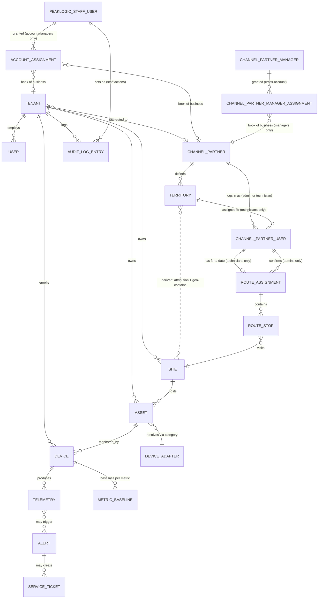

# Domain Model

**Company:** PeakLogic  ·  **Project codename:** Project Vantage
**Product (unified platform):** PeakLogicSystems (cloud) · PeakView360 (HMI/SCADA) · PeakLogic Hubs (edge) · PeakAssist (help)
**Status:** 🟡 Draft v2.0 — unified-platform reframe (amendment pending review/approval — see Revision History, end of document; base document remains Approved v1.1 until v1.2–v2.0 are approved)
**Depends on:** [Vision Document](vision-document.md) (Draft v2), [PRD](prd.md) (Draft v2.0), [SRS](srs.md) (Draft v2.0); prior dependencies ([iOS Application](ios-application.md) #26, [White-Label Estate Branding Design](whitelabel-estate-branding-design.md) #35) unchanged
**Last updated:** 2026-07-25
**v2.0 reframe note:** adds the unified-platform entities (§2.10–§2.14) — PeakView360 HMI, PeakLogic Hub fleet, CMMS, compliance, PeakAssist — per PRD/SRS v2.0. **Verified against `docs/data-model.sql`: all are new** (no migrations are written here — that is Database Schema's #10 job in Phase 2, after the spine checkpoint). Naming canonical per `unified-platform-integration-plan.md` §1.
**Fork note (v1.4):** the first Domain Model amendment specific to the `PeakLogic-Azure` fork's own Azure-pivot feature backlog (PRD/SRS v1.7). See Revision History. The AWS-native `PeakLogic-AWS` repo's own Domain Model is unaffected.

---

## 1. Introduction

### 1.1 Purpose

The SRS specifies *how the system must behave*; it deliberately stops short of naming the actual entities and relationships behind that behavior (SRS §6, §2.6). This document formalizes them: the nouns of the system, the facts each one holds, and how they relate. It is the input to the Database Schema (#10) and API Specification (#11), but it is not itself a schema — no column types, indexes, or storage engine decisions live here.

**This project differs from a from-scratch domain model in one important way**: most of these entities already exist as real tables in `docs/data-model.sql`. This document formalizes what's there, reconciles it against the SRS, and calls out — explicitly, in §6 — anywhere the SRS's new requirements (device adapters, baseline analytics, channel partners) need something the existing schema doesn't have yet.

### 1.2 Scope

In scope: the entities needed to support every SRS §3 feature area (Device Adapter Framework, Sensing Modalities, Alerting, Device Management, Multi-Tenancy, Device & Command Networking, AI & MCP, Channel & Partner Support, Auth, Audit) at the MVP horizon.

Out of scope: exact column types/constraints (→ Database Schema, #10), API request/response shapes (→ API Specification, #11), pool-chemistry/gas-sensor threshold *content* (→ still unassigned, SRS Open Issue #1 — this document only models the *shape* an adapter's rules take, not their values).

### 1.3 Notation

- Entities are named in `PascalCase` and described in a table of key attributes (not exhaustive — only attributes that matter conceptually or are already named in the SRS/existing schema).
- Relationships use standard crow's-foot-style cardinality in prose: **1—1**, **1—***, ***—***, with **0..** prefixes where a relationship is optional.
- "Existing" marks an entity/attribute already present in `docs/data-model.sql`, kept as-is. "New" marks something this SRS's requirements need that isn't in the current schema yet.
- "Derived" marks a value that must never be stored as an independently-mutable field — computed by querying another entity's history instead, following the same principle IronQuill's Domain Model established for its own event-sourced state.

---

## 2. Core Entities

### 2.1 Tenancy & Identity

**Tenant** *(existing)* — an isolated customer organization. Everything else is tenant-scoped, directly or transitively, enforced structurally via Postgres RLS (MT-1.1).
| Attribute | Notes |
|---|---|
| tenant_id | |
| name, slug | |
| plan | trial / starter / professional / enterprise |
| status | active / suspended / trial |
| settings (JSONB) | Includes `webhook_url` (existing) |
| **channel_partner_id (nullable)** | **New** — attributes this tenant to a reseller relationship (CH-1.1) |

**User** *(existing, extended v1.2)* — a person who can authenticate and act in the system.
| Attribute | Notes |
|---|---|
| user_id, cognito_sub, email, display_name | |
| role | Existing enum `admin` / `operator`. **Corrected v1.2**: this document previously listed `service_partner` as a third value (decision 5) — checked directly against `docs/data-model.sql`, the `service_partner` Cognito *group* was removed in Security Architecture v1.1 (no route ever checked for it), but the database-level `CHECK` constraint on `users.role` still allows it, a real leftover inconsistency this amendment closes (Database Schema #10 to tighten the constraint) |
| status | |
| **clock_format (nullable), timezone (nullable), theme (nullable)** | **New, added v1.2** — per-user display preferences (SET-3/SET-4/SET-5). Null means "use the application default" (24-hour, UTC, light) rather than requiring a value at signup — a user who never opens Settings still works correctly |

**ChannelPartner** *(new)* — a reseller/supplier relationship (e.g. a pool-chemical supplier) whose customers' tenants are attributed to them (CH-1.1, CH-2.1).
| Attribute | Notes |
|---|---|
| channel_partner_id | |
| name | |
| contact_info | |
| branding (JSONB, nullable) | **New, added v1.1** — `logo_url`, `primary_color`, `secondary_color` for the white-label portal login (CH-3.1, §2.7). Null for a channel partner that's attribution-only (CH-1/CH-2, every vertical except pool-servicing) — branding only applies once a partner is onboarded to the portal |
| group_id (nullable) | **New, added v1.5** (whitelabel-estate-branding-design.md, #35) — links sibling partners under one holding company (`ChannelPartnerGroup`, below). Not an access grant — see that entity's own note |

A Tenant has **0..1** ChannelPartner (a tenant may or may not have come through a channel relationship); a ChannelPartner has **many** Tenants (CH-2.1's attribution report groups by this relationship). **Added v1.5:** this is the tenant's *default* attribution only — see `Site.channel_partner_id` below for the per-site override that makes a mixed-portfolio tenant representable.

**ChannelPartnerGroup** *(new, v1.5 — whitelabel-estate-branding-design.md, #35)* — the holding company above several `ChannelPartner` rows (e.g. "Purple Standard" above ACE Septic, WTR DR, Boyette Pump & Well, Purple Current, Rodrigues Roofing LLC, Brisa Climate Solutions). **Not the same concept as `ChannelPartnerManager` (§2.9)** — that's a *person* with staff-level access spanning multiple *unrelated* partner accounts; this is a grouping of the partner *accounts themselves* as commonly-owned siblings, used purely to pick a fallback *display brand* for a customer whose sites span more than one sibling. Deliberately does **not** grant any partner-side data access across group members — a partner's own staff session is still scoped to exactly their own `ChannelPartner.channel_partner_id`, never to siblings.
| Attribute | Notes |
|---|---|
| group_id | |
| name | e.g. "Purple Standard" |
| branding (JSONB, nullable) | Same shape as `ChannelPartner.branding` — the fallback brand shown when a tenant's sites span multiple sibling partners under this group |

Scoped to Purple Standard only for now (a real, named need, not offered speculatively to every partner) — the mechanism is generic, the offering is not. A ChannelPartnerGroup has **many** ChannelPartners; a ChannelPartner has **0..1** ChannelPartnerGroup.

### 2.2 Facilities & Assets

**Site** *(existing)* — a physical location (a restaurant, a nursing home, a pumping station).
| Attribute | Notes |
|---|---|
| site_id, tenant_id, name | |
| type | Broadened enum: `pumping_station`, `qsr`, `restaurant`, `pool`, `nursing_home`, `retail`, `light_industrial`, `multifamily_residential`, `other` |
| address, lat/lng, timezone, metadata | **`lat`/`lng` newly load-bearing, added v1.4**: previously only consumed by Territory's derived containment rule (§2.7); now also the direct data source for GEO-1.1's map plotting (SRS §3.16). Still nullable, no schema change — see §6.7 for the pre-existing gap this makes newly visible |
| **model_3d_reference (nullable) — proposed, not yet added, added v1.4** | Placeholder only — see §6.7. Not added to this table (or to Asset) until the 3D-rendering scoping pass (PRD §5.15) resolves format/storage; listed here so a future reader knows this was considered, not overlooked |
| **channel_partner_id (nullable) — new, added v1.5** | (whitelabel-estate-branding-design.md, #35) — a per-site OVERRIDE of the Tenant's own `channel_partner_id`. Null (every pre-existing Site) means "use the Tenant's own attribution, unchanged." This is what makes a mixed-portfolio Tenant (sites serviced by different sibling partners) representable as one Tenant instead of forcing two disconnected ones |

**Asset** *(existing)* — a piece of equipment at a Site being monitored (a pump, a walk-in cooler, a pool pump).
| Attribute | Notes |
|---|---|
| asset_id, tenant_id, site_id, name | |
| category | Free text — existing values `pump`, `hvac`, `pool_system`, `refrigeration`, `leak_sensor`, `energy_meter`; **new** values needed per SRS §3.2: `pool_chemistry`, `gas_sensor`, `air_quality` |
| make, model, serial_number, install_date | |
| specs (JSONB) | Manually entered; consumed by a Device Adapter's threshold functions (DA-2.1) |
| health_status | healthy / warning / critical / offline / unknown |

An Asset's `category` is the join point to exactly one **DeviceAdapter** (§2.3) — this is a resolution rule, not a stored foreign key, mirroring how IronQuill's JurisdictionConfig resolves to a ReferenceDataset by rule rather than a hard reference.

### 2.3 Devices & Adapters

**Device** *(existing)* — a physical IoT device identity, distinct from the Asset it monitors.
| Attribute | Notes |
|---|---|
| device_id, tenant_id, serial, thing_name | `thing_name` is the AWS IoT Core identity |
| asset_id (nullable) | A Device links to **0..1** Asset; an Asset may have **many** Devices (e.g. a walk-in cooler asset could carry both a temperature-probe device and a separate leak-sensor device) |
| firmware_version, status, last_seen_at, provisioned_at | |

**DeviceAdapter** *(new — conceptual entity, not necessarily its own database table at MVP)* — the contract a sensing modality plugs into (DA-1.1, DA-2.1). At MVP this is a **code-defined object** (formalizing `RULES_BY_CATEGORY` in `backend/ingest/handler.ts`), not a database row — per DA-3.1, adapters are code-deployed, not dynamically registered. It is modeled here because it's a real conceptual entity the system reasons about, even though its MVP storage location is source code rather than a table.
| Attribute | Notes |
|---|---|
| category (key) | Matches Asset.category |
| declared_metrics | Names + units this adapter expects (DA-2.1) |
| threshold_rules | metric, condition, threshold (static or specs-derived), severity, message |
| default_specs | Used when an Asset's `specs` are unset |

**MetricBaseline** *(new)* — a maintained, per-device-per-metric rolling statistical baseline (trailing-window mean/standard-deviation) supporting AI-3.1's anomaly detection. Modeled as a maintained entity (updated incrementally as telemetry arrives) rather than recomputed from scratch on every reading, for performance — flagged as a recommendation, not a settled decision, in §6.
| Attribute | Notes |
|---|---|
| device_id, metric, tenant_id | tenant_id denormalized, same rationale as §4.1 |
| trailing_mean, trailing_stddev | |
| window_start, window_end | |
| sample_count | Used to withhold a flag until a minimum history threshold is met (SRS §3.7 error condition) |

### 2.4 Telemetry & Alerting

**Telemetry** *(existing)* — a single timestamped reading from a Device.
| Attribute | Notes |
|---|---|
| time, device_id, tenant_id, metric, value, quality | |

A Telemetry row is evaluated against its Device's Asset's DeviceAdapter (§2.3) at ingest time, and separately against its MetricBaseline (§2.3), producing zero or more Alerts.

**Alert** *(existing, extended)* — a record produced when a telemetry value trips a rule.
| Attribute | Notes |
|---|---|
| alert_id, tenant_id, device_id, asset_id | |
| severity | info / warning / critical |
| type | Existing value `threshold`; `anomaly` (shipped 2026-07-21, AI Analytics Layer Tier 1) so a baseline-deviation flag is distinguishable from a static-threshold alert; `device_silent` (shipped 2026-07-21, Enterprise Audit §3 P0 — `backend/jobs/silence-detection*.ts`) for a device that stopped reporting entirely, distinct from a bad reading. `prediction`/`prescription` reserved for Tiers 2–3, not yet emitted anywhere |
| message, context (JSONB) | |
| status | open / acknowledged / resolved / suppressed |
| triggered_at, acknowledged_at, resolved_at | |

**ServiceTicket** *(existing)* — auto-created for critical Alerts, or manually.
| Attribute | Notes |
|---|---|
| ticket_id, tenant_id, alert_id (nullable), asset_id, assigned_to | |
| title, description, priority, status | |
| webhook_url, external_ref, due_at, resolved_at | |

An Alert has **0..*** ServiceTickets (existing FK is nullable, not unique — in practice, MVP behavior (AL-2.1) creates exactly one per critical Alert).

### 2.5 AI & MCP

**Correction (2026-07-21):** this section originally asserted "no new entities" beyond MetricBaseline. That was accurate for the MCP server (still true — MCP-1.1 is a pure access layer, no entity of its own) but became stale the moment the AI Analytics Layer (`ai-analytics-layer-design.md`, artifact #34) needed somewhere to record *what scored a reading* and *what it found*, distinct from the reading itself (Telemetry) or the resulting Alert. Two new entities, both additive (migration `1783962000000_ai-analytics.sql`):

**AiModel** *(new)* — a scoring-method registry row (metadata; heavy artifacts, if any, live in blob storage and are referenced, not stored here). Tier 1's classical EWMA/z-score scoring (`backend/ingest/anomaly.ts`) doesn't create a row here at all — see AiFinding below.
| Attribute | Notes |
|---|---|
| id, tenant_id (nullable) | NULL = platform-scope/cross-fleet catalog (design §6 — not built; per-tenant only per the 2026-07-21 decision, no platform rows exist) |
| scope_level | `platform` \| `tenant` |
| kind | `anomaly` \| `prediction` \| `prescription` |
| asset_class, metric | Nullable — a Tier 1 statistical method isn't scoped to one asset class |
| method | e.g. `'ewma-zscore'` |
| artifact_ref, metrics_json, trained_at, enabled | For future trained models (Tier 2+); unused by Tier 1 |

**AiFinding** *(new)* — a scored result, whether or not it crossed the threshold to become an Alert.
| Attribute | Notes |
|---|---|
| id, tenant_id, device_id | |
| model_id | Nullable, and left NULL by Tier 1 — there's no trained artifact to reference for a formula, only for Tier 2+ real models |
| kind | `anomaly` \| `prediction` \| `prescription` |
| score | Deviation sigma (anomaly) / failure probability (prediction, not yet emitted) |
| horizon_days | Prediction only, unused by Tier 1 |
| explanation (JSONB) | `{metric, expected, observed, deviation_sigma}` for Tier 1 |
| alert_id | Nullable — set when the finding crossed threshold and became an Alert (most won't, by design: most readings are NOT anomalous) |
| outcome_label | For future CMMS-outcome-based training labels (design §3) — unused; Tier 1 has no dispatch outcomes to learn from |

A Telemetry row is evaluated against its Device's Asset's DeviceAdapter (§2.3), separately against its MetricBaseline (§2.3, Tier 1 anomaly scoring), producing zero or more Alerts. An AiFinding is recorded whenever Tier 1 scoring actually detects an anomaly — independent of whether the resulting Alert is newly created or deduped against one already open — so the AI layer's own record of "what it found" (AiFinding) is never silently undercounted by the user-facing alert feed's deduplication (Alert).

The MCP server (MCP-1.1) remains a pure access/computation layer with no entity of its own — that half of the original claim still holds.

### 2.6 Audit

**AuditLogEntry** *(new, corrected v1.2)* — a record of a state-changing administrative action (AUD-1). **This document's original v1 description was already stale**: it described a single-tenant-scoped shape, but Database Schema v1.1 (approved before this document was corrected — a real, disclosed documentation gap, not a schema problem) already extended it to a dual-scope shape for the channel-partner portal. Corrected here to match `docs/data-model.sql` as it actually exists, not as this document previously (incorrectly) described it.
| Attribute | Notes |
|---|---|
| audit_log_id | |
| tenant_id (nullable) / channel_partner_id (nullable) | **Exactly one** non-null — the "scope" this entry is about. A staff console action (§2.8, new v1.2) is scoped to whichever tenant or channel partner it acted on, reusing these same two columns rather than adding a third scope dimension |
| actor_id (nullable) / actor_channel_partner_user_id (nullable) / **actor_staff_user_id (nullable, new v1.2)** | **At most one** non-null — the "who." All three null is a legitimate system-triggered entry, not an error |
| action, target_entity, target_id | |
| prior_value, new_value (nullable) | |
| occurred_at | |

### 2.7 Channel Partner Portal & Dispatch *(new — added v1.1, see Revision History)*

For the pool-servicing vertical specifically — the entities behind the scoped operational-dispatch portal (CH-3.1) and territory/route management (TR-1.1–TR-3.2). None of this existed in `docs/data-model.sql` before this amendment.

**ChannelPartnerUser** *(new)* — a person who can authenticate into a channel partner's portal (CH-3.1): either a partner-side admin/dispatcher, or a technician. A genuinely new identity surface, not an extension of `User` — a channel partner is not a Tenant, so this is deliberately a separate table/identity space (§4 decision 6).
| Attribute | Notes |
|---|---|
| channel_partner_user_id, channel_partner_id | |
| cognito_sub, email, display_name | Same shape as `User`, different identity space |
| role | `partner_admin` (sees/manages across all the partner's territories) or `technician` (see access-scoping note below) — mirrors `User.role`'s existing single-entity, role-differentiated pattern (§4 decision 5) rather than inventing a separate Technician table *(changed v1.1 during review — see §6.4/Revision History; earlier draft modeled Technician as a separate, login-less entity)* |
| territory_id (nullable) | **0..1** — only meaningful for `role = technician`: the technician's assigned territory. Null for `partner_admin`, or a technician not yet assigned (SRS §3.12 error condition) |

**A `technician`-role ChannelPartnerUser's access is scoped to their assigned territory's sites only** — they can authenticate, but the only Sites/Assets/telemetry readings visible to them are the ones a `TR-2.1` territory assignment already resolves as theirs (§4 decision 6's Territory→Site rule), not every Site attributed to the channel partner. A `partner_admin` has no such restriction. This is the access-control shape (Security Architecture, #13, still owns the concrete enforcement mechanism) — modeled here because it directly follows from the territory assignment already being domain structure, not a new concept.

**Provisioning is `partner_admin`-initiated, not self-service**, for either role: a `partner_admin` creates a technician's login credential and assigns their territory (their "preconfigured assets") and routes — no self-service signup path exists for a channel partner's own portal at MVP. Mirrors CH-1.2's existing internal-assignment-only precedent (a tenant can't self-assign its own channel-partner attribution either); the same "assignment is controlled by whoever has administrative authority over the relationship, not the assignee" principle, applied here at the partner-admin/technician level instead of the PeakLogic/tenant level.

**Territory** *(new)* — a named geographic boundary a channel partner defines to group technician assignments (TR-1.1).
| Attribute | Notes |
|---|---|
| territory_id, channel_partner_id, name | |
| boundary | A geographic polygon. Exact storage type (PostGIS `geography`/`geometry` vs. a JSONB GeoJSON blob) is Database Schema's decision (§5) — `docs/data-model.sql` already has an unused `postgis` extension installed, a strong hint toward finally using it rather than reinventing polygon math in JSONB |

A Territory's Site membership is **derived, not stored** (§1.3 notation): a Site belongs to a Territory if (a) the Site's Tenant is attributed to the Territory's ChannelPartner (existing `Tenant.channel_partner_id`) and (b) the Site's `lat`/`lng` fall within the Territory's `boundary`. No `territory_id` column exists on `Site` — this mirrors the Asset→DeviceAdapter resolution-by-rule pattern (§4 decision 4), not a new precedent. **This derived set is also a technician's "preconfigured assets"** — the exact scoping boundary for their limited portal access, above.

**RouteAssignment** *(new)* — a technician's (`ChannelPartnerUser.role = technician`) suggested-or-confirmed route for one calendar day (TR-3.1, TR-3.2). Distinct from RP-2.1's live-computed urgency list: RP-2.1 is a plain, always-fresh query with no persisted state, but a route the AI has suggested (or a partner has confirmed) must stay stable through the day even as underlying alert/telemetry data keeps changing — that requires a real stored snapshot, not a re-derivable view.
| Attribute | Notes |
|---|---|
| route_assignment_id, technician_user_id, route_date | **1** RouteAssignment per (technician, date). `technician_user_id` references `ChannelPartnerUser` (expected `role = technician`, a data-integrity expectation not a distinct FK type — same category of soft constraint as `Asset.category`↔`DeviceAdapter`) |
| source | `ai_suggested` (produced by the external agent via MCP, TR-3.1) or `manual` — a `partner_admin` may build or edit a technician's route by hand instead of relying on the AI suggestion (e.g. the external agent is unreachable, per SRS §3.12's error condition, or the admin simply prefers to). TR-3.2's "no in-house routing algorithm" constraint is about who computes an *ordering*, not a restriction on manual assignment |
| status | `suggested` or `confirmed` (a `partner_admin` ChannelPartnerUser has reviewed and accepted it) — applies regardless of `source`; a manually-built route still goes through the same confirmation gate as an AI-suggested one |
| confirmed_by (channel_partner_user_id, nullable), confirmed_at (nullable) | Null until `status` transitions to `confirmed` — TR-3.1's "advisory only" requirement modeled as an explicit confirmation gate, not just a status label. Expected `role = partner_admin`, same soft-constraint pattern as above |
| generated_at | |

**RouteStop** *(new)* — one ordered stop within a RouteAssignment.
| Attribute | Notes |
|---|---|
| route_stop_id, route_assignment_id, site_id | |
| sequence_number | The AI-suggested (or partner-adjusted) visit order |

A RouteAssignment has **1—*** RouteStops, each referencing exactly **1** Site. A RouteStop's per-site readings (chemistry, alert status) are **not stored here** — queried live from the same Telemetry/Alert chain RP-2.1 already uses (Site→Asset→Device→Telemetry), the same "don't duplicate what's derivable" principle applied everywhere else in this document except MetricBaseline (§4 decision 3's caching rationale doesn't apply to a once-daily route view).

**Cardinalities:** A ChannelPartner has **many** ChannelPartnerUsers (of either role) and **many** Territories. A Territory has **0..*** ChannelPartnerUsers with `role = technician` assigned to it. A technician-role ChannelPartnerUser has **0..1** RouteAssignment per calendar date.

### 2.8 Internal Administration *(new — added v1.2, see Revision History)*

The entities behind PRD §5.11's Administration Console (IA-1–IA-8) — a **third** identity/access surface, alongside the tenant `User` (§2.1) and the channel-partner `ChannelPartnerUser` (§2.7). None of this existed in `docs/data-model.sql` before this amendment.

**PeakLogicStaffUser** *(new)* — a PeakLogic employee who can authenticate into the Administration Console. Deliberately not an extension of `User` or `ChannelPartnerUser` — PeakLogic staff are neither a tenant's own people nor a channel partner's, the same "genuinely separate identity space" reasoning §2.7 already applied to channel partners (§4 decision 6), extended one level further.
| Attribute | Notes |
|---|---|
| staff_user_id | |
| cognito_sub, email, display_name | Same shape as `User`/`ChannelPartnerUser`, third identity space |
| role | `superadmin` or `account_manager` — mirrors the established single-entity, role-differentiated pattern (§4 decisions 5/8) rather than two separate tables |
| status | active / disabled — a departed employee's access must be revocable without deleting their audit-log history (AuditLogEntry's `actor_staff_user_id` references this table; deleting the row would orphan the audit trail) |

**AccountAssignment** *(new)* — the "book of business" relationship: which tenants/channel partners a given `account_manager`-role PeakLogicStaffUser is permitted to act on (IA-4). **Deliberately does not apply to `superadmin`** — a superadmin's access is unconditional (IA-6), not expressed as a (very large) set of assignment rows; modeling it that way would make "grant a new superadmin full access" require inserting one row per existing tenant/partner, and would need a new row for every *future* tenant/partner too, which defeats the point of "unconditional."
| Attribute | Notes |
|---|---|
| account_assignment_id, staff_user_id | References a PeakLogicStaffUser with `role = account_manager` (a soft data-integrity expectation, same category as `Asset.category`↔`DeviceAdapter` and `RouteAssignment.technician_user_id`↔`role = technician`) |
| tenant_id (nullable) / channel_partner_id (nullable) | **Exactly one** non-null — an assignment is to one tenant or one channel partner, not both at once. An account manager with a mixed book of business (some tenants, some partners) simply has multiple `AccountAssignment` rows |
| assigned_at, assigned_by (staff_user_id, expected `role = superadmin`) | Provenance — who granted this assignment and when, itself a natural audit-log target (IA-7) |

**Cardinalities:** A PeakLogicStaffUser with `role = account_manager` has **0..*** AccountAssignments (zero is a valid, if useless, state — a newly-created account manager not yet given any accounts). A Tenant or ChannelPartner has **0..*** AccountAssignments pointing to it (multiple account managers can share responsibility for one large account — not excluded, though not required by IA-4 either).

**Provisioning is `superadmin`-initiated, not self-service** — the same pattern established for tenant users (existing, manual today) and ChannelPartnerUsers (§2.7, `partner_admin`-initiated): a `superadmin` creates a PeakLogicStaffUser's credential and grants their initial AccountAssignments. No self-service signup path exists for this identity surface at all, at any role (PRD §4, explicit non-goal).

**Flagged, not resolved, here** (same discipline as §4 decision 6 for the channel-partner portal): the concrete RLS/access-control mechanism enforcing AccountAssignment as a real, structural boundary — not just an application-layer filter — is Multi-Tenant Architecture's (#14) job to amend. This one is **materially harder** than the channel-partner-portal precedent: that pattern was read-mostly (a technician viewing sites in their territory); an `account_manager` needs real cross-tenant **write** access (creating tenant users, claiming devices, setting asset specs) scoped to their assigned accounts specifically — and it directly intersects Multi-Tenant Architecture's own already-disclosed open item that no non-owning application database role exists yet (§6 item 6 there). PeakLogicStaffUser's concrete auth mechanism (new Cognito pool vs. an extension of an existing one) is Security Architecture's (#13) job, mirroring decision 6's split of responsibility for the channel-partner portal.

### 2.9 Channel Partner Manager (Cross-Account) *(new — added v1.3, see Revision History)*

The entity behind the iOS app's locked §2.1a decision: one person, **not employed by PeakLogic**, who needs `partner_admin`-level capability (branding, territories, technicians, route confirmation) across **several independent, unrelated `ChannelPartner` accounts at once** — e.g. someone managing the PeakLogic relationship for multiple separate franchise locations that are not themselves related to each other. Distinct from both `ChannelPartnerUser` (§2.7, scoped to exactly one channel partner) and `PeakLogicStaffUser` (§2.8, PeakLogic-employed) — a fourth identity/access surface, not a variant of either existing one.

**ChannelPartnerManager** *(new)* — a person who can authenticate into the same `PartnerPool` `ChannelPartnerUser` already uses (Security Architecture, #13, to confirm the concrete mechanism — same split-of-responsibility pattern as §2.7/§2.8), but whose access spans multiple `ChannelPartner` rows rather than being tied to one.
| Attribute | Notes |
|---|---|
| channel_partner_manager_id | |
| cognito_sub, email, display_name | Same shape as `ChannelPartnerUser`/`PeakLogicStaffUser`, resolved server-side by `cognito_sub` the same way both existing identity surfaces already are |
| status | active / disabled — same revocability reasoning as `PeakLogicStaffUser.status` (§2.8): access must be revocable without deleting the person's audit-log history |

**ChannelPartnerManagerAssignment** *(new)* — the join table granting a ChannelPartnerManager `partner_admin`-level access to one specific `ChannelPartner`. **Deliberately not a hierarchy**: each row is an independent grant to one unrelated account, not a parent/child franchise structure — a manager with access to 5 accounts has 5 rows, and revoking one doesn't imply anything about the other 4. Directly analogous to `AccountAssignment` (§2.8) one level down the identity stack (PeakLogic staff → channel partner accounts instead of PeakLogic staff → tenants/partners), reusing the same "assignment, not inheritance" shape.
| Attribute | Notes |
|---|---|
| channel_partner_manager_assignment_id, channel_partner_manager_id, channel_partner_id | |
| assigned_by_staff_user_id (nullable) / assigned_by_partner_user_id (nullable) | **Exactly one** non-null — mirrors `AuditLogEntry`'s existing dual/multi-actor CHECK-constraint idiom (§2.6, §4 decision 10), applied here to the *grantor* rather than an audit actor. **Locked decision**: either a `superadmin` (PeakLogicStaffUser) OR the target account's own `partner_admin` (ChannelPartnerUser) may create this assignment — not one gated behind the other, unlike `AccountAssignment` (§2.8) which is `superadmin`-only. This is a real, deliberate divergence from the §2.8 precedent, not an oversight: a channel partner's own admin has a legitimate business reason to delegate to a manager without waiting on PeakLogic staff, where a tenant/partner being assigned to a PeakLogic account manager (§2.8) is PeakLogic-internal bookkeeping only |
| assigned_at | |

**Provisioning note, not yet a resolved API shape (flagged for API Specification, #11):** unlike `AccountAssignment` and the original `ChannelPartnerUser`/technician precedents (all admin-initiated against an existing, already-visible identity), a `partner_admin` granting access to a ChannelPartnerManager may be inviting someone who doesn't have a `ChannelPartnerManager` row yet, and — critically — a `partner_admin` has no visibility into the cross-account `channel_partner_managers` table (that would itself be a cross-tenant-style leak). This means provisioning here has to work **by email** (link to an existing manager if one already exists for that email, create a new one otherwise) rather than by picking an existing row, a self-service-invite shape no other identity surface in this document has needed before. Modeled as a real, disclosed gap here rather than assumed away.

**Cardinalities:** A ChannelPartnerManager has **0..*** ChannelPartnerManagerAssignments (each to a distinct ChannelPartner — no duplicate grants to the same account). A ChannelPartner has **0..*** ChannelPartnerManagers assigned to it (more than one manager could plausibly share responsibility for one large partner account, not excluded).

---

### 2.10 PeakView360 HMI *(new — added v2.0; PRD §5.18 / SRS §3.20)*

The operator layer reuses existing entities wherever possible — **alarms are the existing `Alert` (§2.4), not a new entity; a PeakView360 alarm panel is a projection over `Alert`**. What is genuinely new is the *screen and tag* configuration.

**HmiScreen** *(new — verified absent from `docs/data-model.sql`)* — a configured operator screen for a Site (PV-1.1).
| Attribute | Notes |
|---|---|
| screen_id, tenant_id, site_id | RLS-scoped like every operational entity (`tenant_id` denormalized, §4.1) |
| name, screen_type | `overview` / `equipment` / `process` |
| layout (JSONB) | Placement of tiles/tags/widgets; render-target agnostic |
| help_context_key | The PeakAssist context this screen declares (§2.14, PA-2.1/PA-7.1) — a screen without one fails the release gate |

**Tag** *(new — verified absent)* — a named process point mapping a **source** (a Hub's PLC register, or a Device+metric) to a **canonical metric** shown on screens and the historian (HUB-1.1, PV-1.1/PV-3.1). This is the entity form of the Telemetry Normalization Fabric concept (Platform Services #30).
| Attribute | Notes |
|---|---|
| tag_id, tenant_id, site_id | |
| hub_id (nullable) | The acquiring Hub (§2.11); null for a cloud-direct device metric |
| source_ref | PLC address (e.g. Modbus register / OPC-UA node) or `device_id`+`metric` |
| canonical_metric, unit, scale, offset | Maps a raw source value into the same canonical metric space `Telemetry.metric` already uses — so PeakView360, the historian, and the rule/AI pipeline all see one vocabulary |

**HistorianPen** *(new — verified absent)* — a saved multi-pen trend configuration (PV-3.1). The historian itself reads the existing `telemetry`/`telemetry_hourly` tables — no new time-series store; this entity is just the saved *view*.
| Attribute | Notes |
|---|---|
| pen_id, tenant_id, owner (screen_id or user_id) | |
| tag_id or metric, color, axis | |

### 2.11 PeakLogic Hub Fleet *(new — added v2.0; PRD §5.19 / SRS §3.21)*

**Hub** *(new — verified absent; reconciles PeakLogic Edge `windows-hub/`, which has no DB entity today)* — a registered on-prem PeakLogic Hub unit. Distinct from `Device`: a Hub is edge *infrastructure* (the acquiring/serving gateway at a site); Devices are the monitored things. A hub-relayed Device (Device Onboarding #27 Path B) acquires through a Hub; a direct-connect Device (Path A) does not.
| Attribute | Notes |
|---|---|
| hub_id, tenant_id, site_id | A Site has **0..\*** Hubs; a Hub belongs to **exactly one** Site |
| name, hardware_serial | |
| agent_version, peakassist_content_version | The latter drives PA-5.1's "content current as of…" (§2.14) |
| status, last_seen_at | Reuses the same online/offline semantics as `devices.status`; silence detection generalizes to Hubs |
| protocol_config (JSONB) | Which PLC/RTU protocol(s) and endpoints this Hub polls (HUB-1.1) |

A Hub acquires from **0..\*** Devices/Tags; store-and-forwards `Telemetry` to the cloud (HUB-2.1); serves `HmiScreen` live data and `HelpContent` on the LAN (HUB-4.1/HUB-5.1).

### 2.12 CMMS — Work Orders & PM *(new/reconciled — added v2.0; PRD §5.20 / SRS §3.22)*

**WorkOrder** *(new — reconciles the existing `ServiceTicket`, §2.4)* — the generalized maintenance work item. The existing `service_tickets` table (auto-created for critical Alerts) is the **seed**; whether v2.0 **renames/extends `ServiceTicket` into `WorkOrder`** or adds `WorkOrder` as a supertype is a Database Schema (#10) decision, flagged in §6.9 — modeled here conceptually to avoid a parallel duplicate.
| Attribute | Notes |
|---|---|
| work_order_id, tenant_id, asset_id, alert_id (nullable) | `alert_id` set for alarm-driven WOs (CM-2.1), reusing `service_tickets`' existing nullable FK |
| pm_schedule_id (nullable) | Set for PM-generated WOs (§below) |
| assigned_to, title, description, priority | |
| status | `dispatched` → `accepted` → `on_site` → `completed` (the dispatch funnel, #32) — supersedes `service_tickets.status`'s simpler set |
| source, channel_partner_id, cmms_connector_id, dispatched_at | Per the #32 design (attribution + connector linkage) |

**PMSchedule** *(new — verified absent)* — a recurring preventive-maintenance definition (CM-3.1).
| Attribute | Notes |
|---|---|
| pm_schedule_id, tenant_id, asset_id or category | |
| interval, next_due_at, template | "Generate due work orders" creates a `WorkOrder` per due schedule |

**ServiceVisit** *(new — ⚠️ design-only: `service_visits` is referenced by the #32 Reporting/KPI design and the AI feedback-loop design but is **NOT an actual table** — verified absent from `docs/data-model.sql`)* — the dispatch-outcome record that closes the detect→dispatch→outcome loop and doubles as AI training labels (AI design §3). Its absence is a real reconciliation finding: two approved/draft designs assume it exists. Building it is Database Schema (#10) work.
| Attribute | Notes |
|---|---|
| visit_id, tenant_id, work_order_id | |
| outcome, on_site_at, completed_at | `outcome` is the supervised label the AI feedback loop consumes |

### 2.13 Compliance *(new — added v2.0; PRD §5.21 / SRS §3.23)*

**ComplianceReport** *(new — verified absent)* — a generated regulator-relevant report for a period (CP-1.1), operator-assist only (CP-2.1), audit-backed and reproducible (CP-3.1).
| Attribute | Notes |
|---|---|
| report_id, tenant_id, site_id | |
| template_id | e.g. wastewater `npdes_dmr` (§below) |
| period_start, period_end, generated_at, status | |
| content_ref, source_data_ref | Reproducible from retained `telemetry`/`alerts`; `AuditLogEntry` (§2.6) records issuance |

**ComplianceTemplate** *(new — verified absent)* — the report definition per regulation/jurisdiction (platform-scoped, `tenant_id` NULL like Policy Engine platform defaults; per-tenant overrides allowed).

**ExceedanceRecord** *(new — verified absent; largely a projection over `Alert`)* — a logged permit-limit exceedance (CP-4.1). An exceedance is a compliance-specific record over a threshold `Alert` (§2.4) evaluated against a permit limit — modeled separately because a permit limit is a *regulatory* threshold distinct from an operational alarm threshold, and the two can differ.

### 2.14 PeakAssist Content *(new — added v2.0; PRD §5.22 / SRS §3.24)*

Mostly **platform-global** content (`tenant_id` NULL, authored in the cloud CMS), with optional per-tenant overrides — same platform-default-plus-override pattern as the Policy Engine.

**HelpContent** *(new — verified absent; seeded from `sysadmin-guides/` + `user-guides/`)* — a unit of contextual help (PA-3.1).
| Attribute | Notes |
|---|---|
| content_id, help_context_key | The key an `HmiScreen`/cloud page declares (PA-2.1); §2.10's screens reference it |
| type | `screen_guide` / `procedure` / `alarm_explanation` / `troubleshooting` / `playbook` / `glossary` |
| title, body, alarm_type (nullable) | `alarm_type` deep-links an `Alert.type` to its explanation (PA-3.1) |
| content_version | The bundle version this belongs to (below) |

**HelpContentBundle** *(new — verified absent)* — a versioned, checksummed content set synced to Hubs (PA-4.1/PA-5.1).
| Attribute | Notes |
|---|---|
| version, published_at, checksum | A Hub's `peakassist_content_version` (§2.11) points at one of these; drives "content current as of…" |

## 3. Relationship Diagram

---

## 4. Key Modeling Decisions & Rationale

1. **`tenant_id` is denormalized onto every tenant-scoped table** (Telemetry, Alert, ServiceTicket, and the new MetricBaseline/ChannelPartner/AuditLogEntry) even though it's derivable via joins in most cases — this is the existing schema's own established pattern (`docs/data-model.sql`'s RLS policies all key on a directly-present `tenant_id`), continued here for the same reason IronQuill denormalized tenant_id onto LedgerEvent: structural tenant isolation (MT-1.1) should never depend on a join succeeding correctly.
2. **DeviceAdapter is modeled as a real conceptual entity despite being code, not a database row, at MVP.** DA-3.1 is explicit that adapters are code-deployed for MVP — but the *shape* of an adapter (declared metrics, threshold rules, default specs) is real domain structure the system depends on, so it's documented here rather than treated as invisible implementation detail. When a self-service adapter marketplace is eventually built (explicitly out of MVP scope), this entity is the one that needs to move from code into a real table — this document is that future work's starting reference.
3. **MetricBaseline is a maintained entity, not a derived live-query**, unlike IronQuill's strict "always derive, never store mutable state" rule for status-like fields. This is a deliberate difference, not an inconsistency: a rolling statistical baseline over potentially high-volume telemetry is expensive to recompute from raw data on every reading, and unlike a "current assignee" or "completion status" (which represent authoritative state that must never silently diverge from its source events), a baseline is a *derived statistic* that's expected to be periodically recomputed/refreshed — storing it is a caching decision, not a risk to data integrity.
4. **Asset→DeviceAdapter is a resolution rule keyed on `category`, not a foreign key** — consistent with how IronQuill's JurisdictionConfig resolves to a ReferenceDataset by rule. This keeps `assets.category` free-text and adapter-agnostic at the schema level (no migration needed to add a new adapter), matching DA-1.1's requirement that new modalities not require core changes.
5. **User role naming is reconciled, not changed.** The existing `admin`/`operator`/`service_partner` enum values are kept; Tenant Admin/Facility Operator/Service Partner are the product-facing names used in the PRD/SRS/Vision going forward. No migration required.
6. **Channel-partner-scoped entities (§2.7) introduce a second scoping dimension alongside `tenant_id` — added v1.1.** Every entity before this amendment is scoped by exactly one `tenant_id`, enforced structurally by RLS (decision 1). ChannelPartnerUser, Territory, RouteAssignment, and RouteStop are scoped by `channel_partner_id` instead — and a RouteAssignment's stops can reference Sites belonging to *multiple different tenants* (every tenant attributed to that channel partner), which no existing entity in this schema does. **Flagged, not resolved, here**: the concrete RLS/access-control mechanism for this new scoping dimension is Multi-Tenant Architecture's (#14) job to amend; ChannelPartnerUser's concrete auth mechanism is Security Architecture's (#13). Modeled now so those two artifacts have a concrete shape to design against.
7. **Territory→Site is a derived resolution rule (geographic containment + existing tenant attribution), not a stored foreign key — added v1.1.** Consistent with decision 4's Asset→DeviceAdapter precedent. Keeps `sites` schema-stable as territories are redrawn — a territory boundary edit never requires a bulk `UPDATE sites`.
8. **Technician and partner-admin are both `ChannelPartnerUser` roles, not separate entities — added v1.1, resolved during review (§6.4).** Mirrors `User.role`'s existing single-entity, role-differentiated pattern (decision 5) rather than a Field-Service-Partner-style no-login design. **User decision, 2026-07-11: technicians get real logins, but access is scoped to their assigned territory's sites only** (§2.7) — not full portal access, consistent with the "operational dispatch view only" scope already locked for CH-3 overall. **Provisioning is admin-initiated, not self-service**: a `partner_admin` creates a technician's login credential and assigns their territory (preconfigured assets) and routes — mirrors CH-1.2's existing internal-assignment-only precedent (a tenant can't self-assign its own channel-partner reference either). No self-service signup path exists for either role at MVP.
9. **PeakLogicStaffUser is a third, genuinely separate identity space — added v1.2 (§2.8).** Superadmin and account_manager are roles on one entity (decision 5/8's pattern again, now applied a third time), not two tables. `superadmin`'s access is modeled as unconditional, not as a degenerate/universal case of `AccountAssignment` — a deliberate choice to avoid needing a new assignment row every time a new tenant/partner is created (see §2.8's own reasoning).
10. **AuditLogEntry's actor dimension grows to three mutually-exclusive columns, not a polymorphic `actor_type` + `actor_id` pair — added v1.2.** Kept consistent with the existing `tenant_id`/`channel_partner_id` scope-dimension pattern (one nullable column per possibility, a `CHECK` constraint enforcing at-most-one) rather than switching styles for the actor dimension specifically. A polymorphic actor column would need application-level type-checking to stay correct; the three-nullable-column-plus-CHECK approach gets that enforcement from Postgres itself, for free, the same reasoning already applied to the scope dimension in Database Schema v1.1.
11. **This amendment corrects two things this document had already gotten stale on, found while writing it — not new decisions, disclosed for the record.** §2.1's `User.role` list still showed `service_partner` as a live value after Security Architecture v1.1 removed that Cognito group; §2.6's `AuditLogEntry` still showed its pre-v1.1 single-scope shape after Database Schema v1.1 had already extended it. Both corrected in place (§2.1, §2.6) rather than left to compound further.
12. **ChannelPartnerManager is a fourth identity space, not a role added to an existing one — added v1.3.** Unlike `ChannelPartnerUser.role` (partner_admin/technician, decision 8) or `PeakLogicStaffUser.role` (superadmin/account_manager, decision 9), a manager's defining trait is spanning *multiple* `ChannelPartner` rows, which neither existing single-tenant-scoped identity shape can express without a structural change. A new entity plus a dedicated assignment join table (mirroring `AccountAssignment`'s shape) was the smaller, more consistent change than retrofitting cross-account scope onto `ChannelPartnerUser`.
13. **ChannelPartnerManagerAssignment's grantor is dual-actor, deliberately more permissive than AccountAssignment's single-actor (`superadmin`-only) precedent — added v1.3.** `AccountAssignment` (§2.8) is PeakLogic-internal bookkeeping, so restricting it to `superadmin` is correct. A channel partner delegating portal access across their own accounts is the partner's own business decision, not PeakLogic's to gate — so `assigned_by_staff_user_id`/`assigned_by_partner_user_id` are modeled as alternatives (either actor may grant), not staff-only. This is a genuine, disclosed divergence from the §2.8 pattern, not an inconsistency.

---

## 5. What This Document Does Not Decide

- Exact column types, constraints, indexing for any entity above — Database Schema (#10).
- Request/response payload shapes, including the MCP server's exact tool schema — API Specification (#11).
- Pool-chemistry and gas-sensor threshold *content* (the actual numbers) — still unassigned per SRS Open Issue #1; this document only models the shape a DeviceAdapter's `threshold_rules` take.
- Actuation/command entities (e.g. a future Command or CommandAck entity) — explicitly deferred to Device & Command Security Architecture (#12), since no actuation ships at MVP (CC-3/CC-4).
- **Added v1.1:** Territory's `boundary` exact storage type (PostGIS geography/geometry vs. JSONB GeoJSON) — Database Schema (#10). The concrete channel-partner-scoped RLS/access-control mechanism (§4 decision 6) — Multi-Tenant Architecture (#14). ChannelPartnerUser's concrete auth mechanism (new Cognito group vs. new user pool) — Security Architecture (#13).
- **Added v1.2:** The concrete cross-tenant-**write** RLS/access-control mechanism for AccountAssignment (§2.8) — Multi-Tenant Architecture (#14), explicitly flagged there as harder than the v1.1 precedent. PeakLogicStaffUser's concrete auth mechanism — Security Architecture (#13). The `assetId`/`siteId` query-filter shape for `GET /v1/devices` (NAV-5) — API Specification (#11).
- **Added v1.3:** The concrete RLS/access-control mechanism enforcing ChannelPartnerManagerAssignment as a real cross-channel-partner boundary (§2.9) — Multi-Tenant Architecture (#14). ChannelPartnerManager's concrete auth mechanism within `PartnerPool` — Security Architecture (#13). The email-based invite-or-link provisioning flow and the cross-account `GET /v1/partner-manager/overview` orchestration endpoint shape — API Specification (#11).

---

## 6. Open Questions Surfaced While Modeling

### 6.1 MetricBaseline: maintained entity vs. live-derived — resolved
Confirmed as a maintained, incrementally-updated entity (§2.3/§4.3), per the performance rationale in §4.3 — recomputing a rolling statistical baseline from raw telemetry on every evaluation doesn't scale as telemetry volume grows across devices/tenants. Database Schema (#10) is free to design it as a real table.

### 6.2 DeviceAdapter's eventual home — flagged, not urgent
Confirmed as code (not a table) for MVP per DA-3.1. When a self-service third-party adapter marketplace is eventually built (Vision §10, explicitly post-MVP), DeviceAdapter will need to become a real, versioned database entity. No action needed now; noting it so that future work doesn't have to rediscover this transition point.

### 6.3 ChannelPartner cardinality — resolved
Confirmed a Tenant has at most one ChannelPartner (0..1), and a ChannelPartner has many Tenants. If a tenant's channel relationship changes over time (e.g. switches suppliers), MVP does not need to preserve history of that change — CH-1.1 only requires a current attribution, not an audit trail of past attributions. If that's wrong, it should surface now rather than after the Database Schema is written.

### 6.4 Technician login — resolved during review, 2026-07-11
**User decision: technicians get real logins.** Earlier draft modeled Technician as a separate, login-less entity mirroring the Field Service Partner precedent; the user explicitly rejected that default. Resolved by merging Technician into `ChannelPartnerUser` as a `role` value (§2.7, §4 decision 8) rather than keeping two separate person-tables under one ChannelPartner — mirrors `User.role`'s existing pattern. **Access is scoped, not unrestricted**: a technician's visibility is limited to their assigned territory's sites (their "preconfigured assets," the user's own framing) — a real access-control constraint modeled here, with the concrete enforcement mechanism still owned by Security Architecture (#13). **Provisioning is admin-initiated**: a `partner_admin` creates the credential and assigns the territory/routes — no self-service signup.

### 6.5 RouteStop as a separate entity vs. a JSONB array on RouteAssignment — resolved, separate entity chosen *(added v1.1)*
Modeled as a separate table (§2.7) rather than an ordered JSONB array of site IDs on RouteAssignment, consistent with how every other domain-meaningful join in this schema (ServiceTicket→Alert, Device→Asset) is a real relational entity, not a JSONB blob. A per-stop entity also leaves room for a future per-stop completion field without a schema migration, though stop-level completion tracking is explicitly not required at MVP (TR-3.1/TR-3.2 don't ask for it).

### 6.6 ChannelPartnerManager has no PRD/SRS requirement ID yet — flagged, not urgent *(added v1.3)*
This entity traces directly to the iOS Application doc's (#26) §2.1a decision, not to a PRD/SRS requirement — unlike every other entity in this document, which cites a PRD/SRS ID first and a downstream artifact second. This is a genuine ordering inversion (a client-app spec forced a domain concept the PRD/SRS haven't formally named), not an error, but the PRD/SRS should eventually gain an explicit CH-3b-style requirement referencing this role so the ordering inversion doesn't compound further as more artifacts amend around it. Not urgent — Database Schema/Security Architecture/API Specification are free to depend on §2.9 as-is; this is a paperwork-completeness note, not a blocker.

### 6.7 3D-model-asset-reference entity — deliberately not modeled yet *(added v1.4)*
PRD §5.15/SRS §3.17 (3DR-1–3DR-3) require a Site or Asset to optionally carry a reference to an out-of-band-authored 3D model. **Deliberately not given a concrete shape here** — file format, storage mechanism (e.g. blob storage vs. a CDN-fronted asset), and whether the reference belongs on `Site`, `Asset`, or a new join entity (a facility might reasonably have one 3D model per site, or one per asset, or both) are all unresolved per PRD §5.15's own explicit scoping deferral. Modeling a specific shape now would be assuming, not documenting — the same discipline §6.2 already applied to DeviceAdapter's eventual table-ification, and the same one `azure-restructuring-plan.md` §3 explicitly calls for on this feature. **Action for whoever picks up the dedicated 3D-rendering scoping pass**: return to this section (and the placeholder note on `Site`, §2.2) once format/storage/cardinality are decided, rather than letting Database Schema (#10) invent a shape unilaterally.

### 6.8 Site geo-coordinates on Azure — confirmed, not re-litigated *(added v1.4)*
`sites.lat`/`sites.lng` (`DOUBLE PRECISION`, nullable) require no Domain-Model-level change to support GEO-1.1 (SRS §3.16) — they already exist, and Postgres geometry (`DOUBLE PRECISION`, and the existing `postgis` extension already used by Territory's containment query, §2.7) is standard Postgres, portable to Azure Database for PostgreSQL as-is per `azure-restructuring-plan.md` item 10. The concrete confirmation that Azure Database for PostgreSQL supports the installed `postgis` extension version this schema depends on is Database Schema's (#10) job, not re-litigated here — flagged so that artifact doesn't have to rediscover the dependency.

### 6.9 WorkOrder vs. ServiceTicket, and the missing `service_visits` table — flagged for Database Schema *(added v2.0)*
Two real reconciliation items surfaced while modeling §2.12: (1) whether the unified CMMS `WorkOrder` is a **rename/extension** of the existing `service_tickets` table or a supertype above it — a schema-shape decision deferred to Database Schema (#10), modeled conceptually here to avoid a duplicate; (2) `service_visits` is **referenced by two designs** (Reporting/KPI #32 and the AI feedback loop #34) **but is not an actual table** in `docs/data-model.sql`. That gap is now recorded, not assumed away — the detect→dispatch→outcome loop and the AI's supervised training labels both depend on an entity that has never shipped.

### 6.10 PeakView360 `Tag` vs. the Telemetry Normalization Fabric; PdM asset↔tag mapping — flagged, not urgent *(added v2.0)*
§2.10's `Tag` entity and Platform Services' (#30) Telemetry Normalization Fabric are the **same concept** at two altitudes (a per-source→canonical-metric mapping) — they must be unified, not built twice, when Platform Services and Database Schema are amended. Separately, MooreView's PdM (asset↔SCADA-tag mapping + feature batching, absorbed per MV-2.1) extends the existing `AiModel`/`AiFinding` (§2.5, `kind='prediction'`) rather than adding a parallel entity; the asset↔tag mapping it needs is exactly §2.10's `Tag`. No new PdM entity is modeled until Tier 2 is actually scoped.

---

## 7. Traceability

Every entity/attribute above cites the SRS requirement it formalizes inline, or is marked *(existing)* against `docs/data-model.sql`. No entity here should be treated as authoritative until the Open Questions in §6 are resolved and this document is marked Approved, at which point the Database Schema (#10) becomes free to depend on it. **Added v1.1:** §2.7 (ChannelPartnerUser, Territory, RouteAssignment, RouteStop) traces to PRD §5.8 (CH-3/CH-3a) + §5.10 (TR-1–TR-3) and SRS §3.8 (CH-3.1/CH-3a.1) + §3.12 (TR-1.1–TR-3.2). All §6 open questions are now resolved (§6.4 resolved during review, 2026-07-11) — Security Architecture (#13) should design the technician access-scoping mechanism (§2.7) as real requirement input, not a placeholder. **Added v1.2:** §2.8 (PeakLogicStaffUser, AccountAssignment) traces to PRD §5.11 (IA-1–IA-8) and SRS §3.13 (IA-1.1–IA-8.1); the `User`/`clock_format`/`timezone`/`theme` additions trace to PRD §5.12 (SET-3/SET-4/SET-5) and SRS §3.14.

**Added v1.3:** §2.9 (ChannelPartnerManager, ChannelPartnerManagerAssignment) traces to the iOS Application doc's (#26) locked §2.1a role decision — a real precedent for a downstream artifact forcing a Domain Model amendment, same as §2.7/§2.8's PRD/SRS-driven amendments, except the forcing document is a client-application spec rather than the PRD/SRS directly. No PRD/SRS requirement ID exists yet for this role — flagged in §6 below as an open item for whoever picks up the PRD/SRS amendment this should eventually get.

**Added v1.4:** `Site.lat`/`Site.lng` (§2.2) trace to PRD §5.14/SRS §3.16 (GEO-1.1) as a newly-load-bearing existing attribute, no new entity. The 3D-model-asset-reference concept (PRD §5.15/SRS §3.17) is explicitly *not* traced to a concrete entity yet — see §6.7 — since the PRD itself defers that shape to a dedicated scoping pass.

**Added v2.0:** §2.10 (HmiScreen, Tag, HistorianPen) traces to PRD §5.18/SRS §3.20; §2.11 (Hub) to PRD §5.19/SRS §3.21; §2.12 (WorkOrder, PMSchedule, ServiceVisit) to PRD §5.20/SRS §3.22; §2.13 (ComplianceReport, ComplianceTemplate, ExceedanceRecord) to PRD §5.21/SRS §3.23; §2.14 (HelpContent, HelpContentBundle) to PRD §5.22/SRS §3.24. All verified new against `docs/data-model.sql`; none is authoritative for Database Schema (#10) until this document is Approved. Two reconciliation findings recorded in §6.9–§6.10 (WorkOrder/ServiceTicket shape; `service_visits` referenced-but-absent; Tag ≡ Normalization Fabric).

---

## 8. Review Log

**v1 (2026-07-04):** all open items raised during review resolved; no outstanding sign-offs remained at that time.

1. **MetricBaseline maintained vs. live-derived (§6.1)**: confirmed as a maintained entity, for the performance reasons already stated in §4.3. No change to the modeling.
2. **DeviceAdapter's eventual home (§6.2)**: confirmed as code, not a table, for MVP — no action needed now; flagged for whenever a self-service adapter marketplace is scoped.
3. **ChannelPartner cardinality (§6.3)**: confirmed — a Tenant has at most one ChannelPartner, no attribution-history tracking required at MVP.

**v1.1 (2026-07-11), reviewed 2026-07-11:** one open question surfaced deliberately (§6.4), then resolved same-day by direct user decision rather than left open through approval.

4. **Technician login (§6.4) — flagged as genuinely open, then resolved by the user, not assumed.** First draft modeled Technician with no login (mirroring the Field Service Partner precedent) and explicitly called this out as an unconfirmed judgment call rather than quietly deciding it. The user's answer — real logins, scoped to preconfigured (territory) assets, admin-provisioned — was incorporated by merging Technician into `ChannelPartnerUser` as a role, not bolting a login onto the separate entity, since the role-based single-entity shape already matches this document's existing `User.role` pattern (§4 decision 5).
5. **Re-verified, held up:** the claim that `docs/data-model.sql` has an installed-but-unused `postgis` extension (checked directly against the file's `CREATE EXTENSION` statements, not assumed from memory); that RP-2.1 is a live query with no persisted state, distinguishing it correctly from the new RouteAssignment's need for a stable, confirmable snapshot; CH-1.2's internal-assignment-only precedent (re-checked against PRD §5.8's exact wording) as the right analogy for admin-initiated technician provisioning.

**v1.2 (2026-07-12), reviewed 2026-07-12:** two real staleness bugs found in this document's own prior content while amending it, not just new entities added.

6. **§2.1's `User.role` list was wrong, not just incomplete.** Checked `infra/lib/auth-stack.ts` directly rather than trusting this document's own decision 5 — confirmed the `service_partner` Cognito group was removed in Security Architecture v1.1, but this document still listed it as a current value. A second check, against `docs/data-model.sql`'s actual `users.role` `CHECK` constraint, found the database-level constraint was *never* updated to match — a real, live inconsistency (the DB still accepts a role the application no longer grants through any group), not just a documentation lag. Flagged for Database Schema (#10) to close.
7. **§2.6's `AuditLogEntry` was describing a shape that stopped being true after Database Schema v1.1 shipped**, and nothing caught it at the time. Checked `docs/data-model.sql`'s actual `CREATE TABLE audit_log_entries` directly and corrected the entity description to match — the dual-scope/dual-actor columns and their `CHECK` constraints were already real, just never reflected back into this document.
8. **AccountAssignment's design (§2.8) was checked against the locked decision, not re-litigated:** confirmed the "assigned subset" requirement (PRD IA-4, locked via the user's earlier explicit choice) is modeled as a real join table, and confirmed `superadmin`'s unconditional access is deliberately *not* expressed through that same table (see §2.8's own reasoning) — re-read the original AskUserQuestion exchange rather than assuming the model's shape from memory.

**v1.3 (2026-07-13), amended 2026-07-13:** formalizes a role already locked by direct user decision in an earlier session (iOS Application doc §2.1a), not a new design exercise — re-verified against that doc's exact wording rather than re-derived from memory.

9. **ChannelPartnerManager's dual-actor grantor (§2.9) was deliberately checked against, and found to diverge from, the AccountAssignment precedent (§2.8) rather than copied blindly.** AccountAssignment is `superadmin`-only because it's PeakLogic-internal bookkeeping; a channel partner's own `partner_admin` has legitimate standing to grant manager access across their own accounts without waiting on PeakLogic staff, so the grantor is modeled as either actor, not staff-only. Recorded as a real, disclosed divergence, not an inconsistency between the two entities.
10. **The email-based invite-or-link provisioning gap was surfaced, not assumed away.** Every other admin-initiated provisioning pattern in this document (ChannelPartnerUser, PeakLogicStaffUser's AccountAssignment) assumes the grantor can already see/select the identity being granted access. A `partner_admin` granting ChannelPartnerManager access structurally cannot see the cross-account `channel_partner_managers` table (that visibility would itself be a cross-account leak) — so this provisioning flow needs an email-based invite that either links an existing manager or creates a new one, a genuinely new shape with no existing precedent in this schema to copy. Flagged explicitly in §2.9 for API Specification rather than left implicit.

---

## Revision History

**v1.1 (2026-07-11)** — forced by the PRD v1.5/SRS v1.5 amendment (channel-partner portal, territory/dispatch management), per this document's own rule (§7) that a downstream — here, upstream-then-cascading — requirements change must amend this document explicitly rather than leaving Database Schema to invent entities unilaterally.

- **ChannelPartner amended**: added a nullable `branding` (JSONB) attribute for the white-label portal login (CH-3.1).
- **§2.7 added**: ChannelPartnerUser (a genuinely new identity surface, separate from `User`; covers both `partner_admin` and `technician` roles — see below), Territory (map-drawn boundary, Site membership derived not stored), RouteAssignment and RouteStop (a stored, confirmable snapshot distinct from RP-2.1's live-computed urgency list).
- **§4 decisions 6–8 added**: channel-partner-scoping as a genuinely new second scoping dimension alongside `tenant_id` (flagged for Multi-Tenant Architecture and Security Architecture, not resolved here); Territory→Site as a derived resolution rule (consistent with the existing Asset→DeviceAdapter precedent); technician/partner-admin modeled as ChannelPartnerUser roles.
- **Resolved during review, same day, per direct user decisions:** the first draft modeled a separate, login-less Technician entity (mirroring the Field Service Partner precedent) and flagged it as an open question (§6.4). The user rejected that default: **technicians get real logins.** Redesigned as a single `ChannelPartnerUser` entity with a `role` column (`partner_admin` / `technician`), mirroring `User.role`'s existing pattern rather than a separate table. Two more user-specified constraints incorporated in the same pass: **a technician's access is scoped to their assigned territory's sites only** (their "preconfigured assets"), not full portal access; and **a `partner_admin` creates the technician's credential and assigns their territory/routes** — provisioning is admin-initiated, not self-service, mirroring CH-1.2's existing internal-assignment-only precedent. RouteAssignment gained a `source` (`ai_suggested` / `manual`) attribute so a partner_admin can also hand-build a route, not only confirm an AI suggestion. §6.4 is now resolved, not open; §6.5 (RouteStop as a separate entity) was already resolved.
- **Explicitly not resolved in this pass** (tracked in `project-peaklogic-channel-partner-portal` memory): Territory's exact geometry storage type, the channel-partner-scoped RLS mechanism, and ChannelPartnerUser's concrete Cognito mechanism (including how a technician's scoped access is actually enforced at the auth/query layer) — all deferred to their respective downstream artifacts (Database Schema, Multi-Tenant Architecture, Security Architecture).

**v1.2 (2026-07-12)** — forced by the PRD v1.6/SRS v1.6 amendment (Internal Administration Console, Settings & Preferences, Site→Asset→Device Drill-Down), surfaced by direct hands-on product use rather than a planned artifact review, per this document's own rule (§7).

- **§2.1 `User` extended**: nullable `clock_format`/`timezone`/`theme` display-preference attributes (SET-3/SET-4/SET-5), null meaning "application default."
- **§2.1 `User.role` corrected, not just extended**: found and disclosed that this document's own `service_partner` reference was already stale (removed as a Cognito group in Security Architecture v1.1) and that the underlying database `CHECK` constraint was never tightened to match — a real, live inconsistency, not a documentation nit.
- **§2.6 `AuditLogEntry` corrected**: this document's description had already drifted out of sync with Database Schema v1.1's actual dual-scope/dual-actor shape; corrected to match reality, and extended with a third actor column (`actor_staff_user_id`) for the new identity surface below.
- **§2.8 added**: PeakLogicStaffUser (a third, genuinely separate identity space — `superadmin`/`account_manager` roles on one entity, mirroring the established pattern) and AccountAssignment (the "book of business" join table implementing the user's locked decision that Account Manager access is an explicitly assigned subset, not universal — `superadmin` deliberately modeled as unconditional access, not a degenerate case of this same table).
- **§4 decisions 9–11 added**: PeakLogicStaffUser as a third identity space; AuditLogEntry's actor dimension staying consistent with the existing nullable-column-plus-CHECK style rather than switching to a polymorphic actor type; explicit disclosure of the two staleness corrections (not new decisions, but recorded for the same reason every other correction in this project's history has been recorded — so a future reader doesn't wonder whether it was intentional).
- **§4 decision 6's pattern extended, not repeated blindly**: AccountAssignment's cross-tenant RLS/access-control mechanism is flagged, not resolved, here — and explicitly called out as *harder* than the channel-partner-portal precedent, since it needs real cross-tenant write, not read-mostly access, and directly intersects Multi-Tenant Architecture's own already-known gap (no non-owning application DB role exists yet).
- **Explicitly not resolved in this pass** (tracked in `project-peaklogic-admin-console-and-settings` memory): the concrete RLS/access-control mechanism for AccountAssignment, PeakLogicStaffUser's concrete Cognito mechanism, and the exact API shape for the new `assetId`/`siteId` device filters — all deferred to their respective downstream artifacts (Database Schema, Multi-Tenant Architecture, Security Architecture, API Specification).

**v1.3 (2026-07-13)** — forced by the iOS Application doc's (#26) already-locked §2.1a Channel Partner Manager decision (made in an earlier session), formalized here as the first step of that doc's own required amendment sequence (Domain Model → Database Schema → Security Architecture → API Specification) before any implementation begins.

- **§2.9 added**: ChannelPartnerManager (a fourth identity space — not PeakLogic staff, not scoped to one channel partner) and ChannelPartnerManagerAssignment (the cross-account grant join table, explicitly modeled as independent grants, not a franchise hierarchy).
- **§4 decisions 12–13 added**: ChannelPartnerManager as a genuinely new identity space rather than a role bolted onto `ChannelPartnerUser`; ChannelPartnerManagerAssignment's dual-actor grantor as a deliberate, disclosed divergence from `AccountAssignment`'s staff-only precedent.
- **§6.6 added**: flags that this entity has no PRD/SRS requirement ID yet (traces to the iOS doc directly) — a paperwork-completeness gap, not a blocker.
- **Explicitly not resolved in this pass** (tracked in `project-peaklogic-client-apps` memory): the concrete cross-channel-partner RLS/access-control mechanism (Multi-Tenant Architecture, #14), ChannelPartnerManager's concrete auth mechanism within `PartnerPool` (Security Architecture, #13), and the email-based invite-or-link provisioning API shape plus the `GET /v1/partner-manager/overview` orchestration endpoint (API Specification, #11) — all deferred to their respective downstream artifacts, continuing this amendment sequence.

**v1.4 (2026-07-17)** — the first amendment specific to the `PeakLogic-Azure` fork, forced by the PRD v1.7/SRS v1.7 amendment (Azure-pivot feature backlog: geospatial site map, 3D facility rendering), per this document's own rule (§7) that an upstream requirements change must amend this document explicitly.

- **§2.2 `Site` annotated, not schema-changed**: `lat`/`lng` are now also the direct data source for GEO-1.1's map plotting (SRS §3.16), in addition to their existing role in Territory's derived containment rule (§2.7). No new attribute, no migration — a newly-load-bearing existing one, called out so a future reader understands why these nullable columns suddenly matter more than before.
- **§6.7 added**: the 3D-model-asset-reference concept (PRD §5.15/SRS §3.17) is explicitly **not** modeled with a concrete shape — format, storage, and cardinality (per-Site vs. per-Asset vs. both) are all unresolved per the PRD's own deferral, and inventing a shape here would be assuming ahead of a dedicated scoping pass, not documenting a decision.
- **§6.8 added**: confirms `sites.lat`/`sites.lng` and the existing `postgis`-backed Territory containment query require no Domain-Model-level change for Azure — standard Postgres, portable to Azure Database for PostgreSQL as-is. Flags (does not resolve) that Database Schema (#10) should confirm the specific `postgis` extension version is available on the target Azure Postgres offering.
- **Downstream artifacts requiring their own amendments as a result** (tracked in `azure-restructuring-plan.md` §2): Database Schema (confirm `postgis`/Azure Postgres compatibility; no new columns needed for GEO features), API Specification (map data endpoint, reusing existing site fields), UX Wireframes (map view, mapping-technology evaluation). The 3D-model entity is explicitly deferred, not assigned to any artifact yet, per §6.7.

**Process note, 2026-07-21 (before v1.5 below):** §2.5 was corrected the same day, earlier in the session, for the AI Analytics Layer (#34) — added `AiModel`/`AiFinding` entities, corrected the section's stale "no new entities" claim — **without a formal version bump or Revision History entry at the time.** Recorded here retroactively so this history stays complete; not repeating the omission going forward.

**v1.5 (2026-07-21)** — forced by [White-Label Estate Branding Design](whitelabel-estate-branding-design.md) (#35), surfaced while reviewing the leadership deck's "customers see your brand, not ours" claim against the real codebase and finding it wasn't actually built for a channel partner's own end customers (only for that partner's staff).

- **Real structural gap found, not just a branding question**: `ChannelPartner`'s existing 0..1 cardinality onto `Tenant` meant a customer serviced by two different sibling partners (e.g. WTR DR for pools, ACE Septic for wastewater) could not be represented as one Tenant at all — it would have needed two disconnected Tenant rows.
- **§2.1 `ChannelPartner` extended**: nullable `group_id`, linking to the new `ChannelPartnerGroup`.
- **§2.1 `ChannelPartnerGroup` added**: the holding company above several sibling `ChannelPartner`s (e.g. "Purple Standard"). Explicitly disambiguated from `ChannelPartnerManager` (§2.9, a *person* spanning unrelated accounts) — this groups the *accounts* as commonly-owned siblings, purely for branding-fallback purposes, and deliberately grants no cross-sibling data access.
- **§2.2 `Site` extended**: nullable `channel_partner_id`, a per-site override of the Tenant's own default attribution — this, not the group entity, is what actually makes a mixed-portfolio Tenant representable; the group only decides which brand to show once it is.
- **A second real bug found while tracing the RLS interaction through** (not theorized — traced how `channel_partner_can_read_site()` actually executes): it has no `SECURITY DEFINER`, so its internal join into `tenants` is itself subject to `tenants`' own RLS. The pre-existing `tenants.channel_partner_read` policy, unwidened, would have silently blocked that join for a mixed-attribution tenant's site-level override — looking correct in the function body while never actually resolving. Fixed in the same migration (`1784048400000`), documented in full in artifact #35 §2.
- **Deliberately scoped to Purple Standard only** — a real, named need per explicit user direction, not built speculatively for every partner. No feature flag: the mechanism is generic and shipped; the offering is not generally marketed.
- **Shipped same day, not just designed**: migration `1784048400000_channel-partner-groups.sql`; `backend/shared/branding.ts` (`resolveEstateBranding`, pure, 8 tests); `docs/data-model.sql` mirrored.
- **Explicitly not resolved in this pass**: no API endpoint exposes any of this to a frontend yet; no frontend theming exists anywhere in `frontend/`; no admin-console UI to manage `ChannelPartnerGroup` rows or per-site overrides (all deferred per artifact #35 §7, tracked in `project_peaklogic_whitelabel_estate_design` memory).

**v1.6 (2026-07-21, same day)** — forced by closing the Enterprise Audit's (2026-07-19) §3 P0 finding: "no code path turns absence of telemetry into an alert... a dead freezer sensor is indistinguishable from a healthy freezer." Executes an already-audited, already-prioritized roadmap item — no new design artifact was written (the audit itself is the authoritative design source); see `project_peaklogic_next_steps` memory for the roadmap context.

- **§2.4 `Alert.type` extended**: new value `device_silent` (`backend/jobs/silence-detection.ts`/`silence-detection-handler.ts`) — a device that stopped reporting entirely, distinct from `threshold`/`anomaly` (both of which require a *bad reading*, not an *absent* one).
- **§2.2 `Device.status`'s existing `'offline'` value is now actually reachable**: verified by grep before building this that nothing had ever set it despite the schema/type allowing it since v1.0. The silence sweep sets it; the existing ingest heartbeat already flips it back to `'online'` on the device's next real reading — self-correcting, no new lifecycle state needed.
- **No new entities or tables** — this reuses `devices.last_seen_at` (existing) and emits into the existing `alerts` table (`type` has always been unconstrained TEXT, no CHECK constraint to widen).
- **A new, narrowly-scoped RLS carve-out on `Tenant`** (migration `1784051700000`, mirrors `app.ingest_context`'s existing precedent): a scheduled sweep needs to enumerate tenant ids before fanning out per-tenant work through the unmodified `withTenant()` — documented in full in the migration's own header comment, not repeated here.
- **Deliberately out of scope**: a device that has *never* reported at all (`last_seen_at` null) is a different failure mode (onboarding/connectivity, not "was alive, went dark") and isn't flagged by this pass. Per-category severity escalation (e.g. `leak_sensor`/`gas_sensor` silence going straight to `critical`, matching those categories' real-threshold precedent of skipping the warning tier) is flagged as a reasonable follow-up once operational data justifies it, not built speculatively.

**Draft v2.0 (2026-07-25)** — the **unified-platform reframe**, forced by PRD/SRS v2.0 (`../business/unified-product-vision.md`; `unified-platform-integration-plan.md`). First Domain Model amendment in the `PeakLogic-Azure-V2` merger repo; follows Vision Draft v2. Non-silent per §7.

- **Header/naming corrected** to canonical, retiring "PeakView Hub / PeakView 360."
- **§2.10 added** (PeakView360 HMI): `HmiScreen`, `Tag` (per-source→canonical-metric mapping — the entity form of the Telemetry Normalization Fabric), `HistorianPen`. **Deliberate reuse call: alarms are the existing `Alert` (§2.4), not a new entity** — a PeakView360 alarm panel is a projection over `Alert`; the historian reads existing `telemetry`/`telemetry_hourly`, no new time-series store.
- **§2.11 added** (PeakLogic Hub fleet): `Hub` — reconciles PeakLogic Edge (`windows-hub/`), which has **no DB entity today**. Modeled as edge infrastructure distinct from `Device`; reuses `devices.status` online/offline semantics.
- **§2.12 added** (CMMS): `WorkOrder` (reconciles/generalizes existing `service_tickets`), `PMSchedule` (new), `ServiceVisit` — **flagged design-only: `service_visits` is referenced by #32 and #34 but is not an actual table** (verified absent). Real reconciliation finding, recorded in §6.9.
- **§2.13 added** (compliance): `ComplianceReport`, `ComplianceTemplate`, `ExceedanceRecord` (the last largely a projection over `Alert` against a permit limit).
- **§2.14 added** (PeakAssist): `HelpContent`, `HelpContentBundle` — platform-global-plus-override pattern (like Policy Engine), seeded from the existing guides corpus; `HmiScreen.help_context_key` binds screens to help (PA-2.1/PA-7.1).
- **§6.9/§6.10 added** (open questions): WorkOrder/ServiceTicket schema shape + the missing `service_visits` table (→ Database Schema #10); `Tag` ≡ Normalization Fabric unification and PdM reusing `AiModel`/`AiFinding` + `Tag` (→ Platform Services #30 / Tier-2 scoping).
- **§7 traceability extended.** **Code reconciliation was verification-only** (grep against `docs/data-model.sql`): every §2.10–§2.14 entity confirmed new; no migrations written — that is Database Schema's (#10) job in Phase 2, after the spine checkpoint. The one substantive finding (`service_visits` referenced-but-absent) is carried into Phase 2.
- **Downstream (sequenced by the integration plan):** Database Schema (#10, the real migrations), API Specification (#11), plus the Phase-2/3 architecture and design docs.
