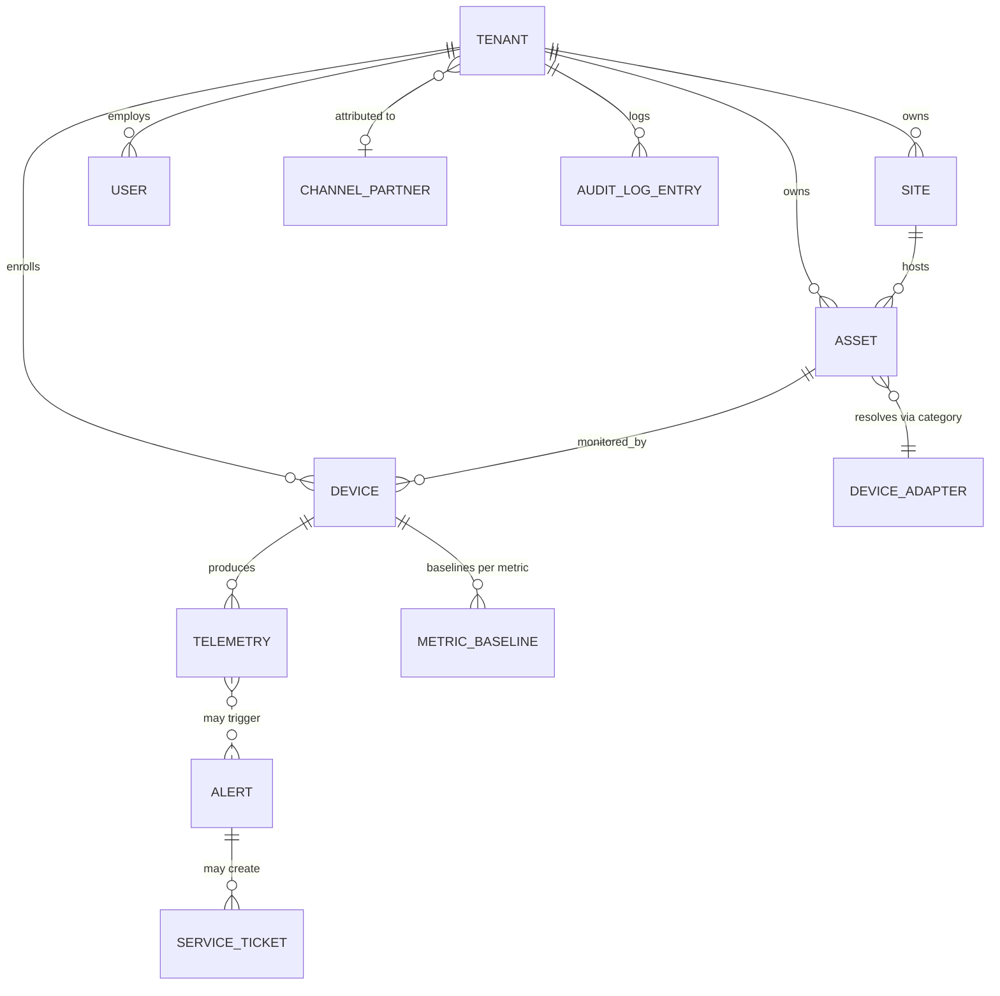

# Domain Model

**Product:** PeakView Hub / PeakView 360
**Cloud Platform:** PeakLogicSystems
**Project Codename:** Vantage
**Status:** Draft v0.1
**Depends on:** [Vision Document](vision-document.md) (approved v1), [PRD](prd.md) (approved v1), [SRS](srs.md) (approved v1)
**Last updated:** 2026-07-04

---

## 1. Introduction

### 1.1 Purpose

The SRS specifies *how the system must behave*; it deliberately stops short of naming the actual entities and relationships behind that behavior (SRS §6, §2.6). This document formalizes them: the nouns of the system, the facts each one holds, and how they relate. It is the input to the Database Schema (#10) and API Specification (#11), but it is not itself a schema — no column types, indexes, or storage engine decisions live here.

**This project differs from a from-scratch domain model in one important way**: most of these entities already exist as real tables in `docs/data-model.sql`. This document formalizes what's there, reconciles it against the SRS, and calls out — explicitly, in §6 — anywhere the SRS's new requirements (device adapters, baseline analytics, channel partners) need something the existing schema doesn't have yet.

### 1.2 Scope

In scope: the entities needed to support every SRS §3 feature area (Device Adapter Framework, Sensing Modalities, Alerting, Device Management, Multi-Tenancy, Device & Command Networking, AI & MCP, Channel & Partner Support, Auth, Audit) at the MVP horizon.

Out of scope: exact column types/constraints (→ Database Schema, #10), API request/response shapes (→ API Specification, #11), pool-chemistry/gas-sensor threshold *content* (→ still unassigned, SRS Open Issue #1 — this document only models the *shape* an adapter's rules take, not their values).

### 1.3 Notation

- Entities are named in `PascalCase` and described in a table of key attributes (not exhaustive — only attributes that matter conceptually or are already named in the SRS/existing schema).
- Relationships use standard crow's-foot-style cardinality in prose: **1—1**, **1—***, ***—***, with **0..** prefixes where a relationship is optional.
- "Existing" marks an entity/attribute already present in `docs/data-model.sql`, kept as-is. "New" marks something this SRS's requirements need that isn't in the current schema yet.
- "Derived" marks a value that must never be stored as an independently-mutable field — computed by querying another entity's history instead, following the same principle IronQuill's Domain Model established for its own event-sourced state.

---

## 2. Core Entities

### 2.1 Tenancy & Identity

**Tenant** *(existing)* — an isolated customer organization. Everything else is tenant-scoped, directly or transitively, enforced structurally via Postgres RLS (MT-1.1).
| Attribute | Notes |
|---|---|
| tenant_id | |
| name, slug | |
| plan | trial / starter / professional / enterprise |
| status | active / suspended / trial |
| settings (JSONB) | Includes `webhook_url` (existing) |
| **channel_partner_id (nullable)** | **New** — attributes this tenant to a reseller relationship (CH-1.1) |

**User** *(existing)* — a person who can authenticate and act in the system.
| Attribute | Notes |
|---|---|
| user_id, cognito_sub, email, display_name | |
| role | Existing enum `admin` / `operator` / `service_partner`. **Naming reconciliation**: these map to the PRD/SRS's Tenant Admin / Facility Operator / Service Partner respectively — same values, no schema change, just the display names used in product docs going forward |
| status | |

**ChannelPartner** *(new)* — a reseller/supplier relationship (e.g. a pool-chemical supplier) whose customers' tenants are attributed to them (CH-1.1, CH-2.1).
| Attribute | Notes |
|---|---|
| channel_partner_id | |
| name | |
| contact_info | Minimal at MVP — no self-service portal (CH-3.1) |

A Tenant has **0..1** ChannelPartner (a tenant may or may not have come through a channel relationship); a ChannelPartner has **many** Tenants (CH-2.1's attribution report groups by this relationship).

### 2.2 Facilities & Assets

**Site** *(existing)* — a physical location (a restaurant, a nursing home, a pumping station).
| Attribute | Notes |
|---|---|
| site_id, tenant_id, name | |
| type | Broadened enum: `pumping_station`, `qsr`, `restaurant`, `pool`, `nursing_home`, `retail`, `light_industrial`, `multifamily_residential`, `other` |
| address, lat/lng, timezone, metadata | |

**Asset** *(existing)* — a piece of equipment at a Site being monitored (a pump, a walk-in cooler, a pool pump).
| Attribute | Notes |
|---|---|
| asset_id, tenant_id, site_id, name | |
| category | Free text — existing values `pump`, `hvac`, `pool_system`, `refrigeration`, `leak_sensor`, `energy_meter`; **new** values needed per SRS §3.2: `pool_chemistry`, `gas_sensor`, `air_quality` |
| make, model, serial_number, install_date | |
| specs (JSONB) | Manually entered; consumed by a Device Adapter's threshold functions (DA-2.1) |
| health_status | healthy / warning / critical / offline / unknown |

An Asset's `category` is the join point to exactly one **DeviceAdapter** (§2.3) — this is a resolution rule, not a stored foreign key, mirroring how IronQuill's JurisdictionConfig resolves to a ReferenceDataset by rule rather than a hard reference.

### 2.3 Devices & Adapters

**Device** *(existing)* — a physical IoT device identity, distinct from the Asset it monitors.
| Attribute | Notes |
|---|---|
| device_id, tenant_id, serial, thing_name | `thing_name` is the AWS IoT Core identity |
| asset_id (nullable) | A Device links to **0..1** Asset; an Asset may have **many** Devices (e.g. a walk-in cooler asset could carry both a temperature-probe device and a separate leak-sensor device) |
| firmware_version, status, last_seen_at, provisioned_at | |

**DeviceAdapter** *(new — conceptual entity, not necessarily its own database table at MVP)* — the contract a sensing modality plugs into (DA-1.1, DA-2.1). At MVP this is a **code-defined object** (formalizing `RULES_BY_CATEGORY` in `backend/ingest/handler.ts`), not a database row — per DA-3.1, adapters are code-deployed, not dynamically registered. It is modeled here because it's a real conceptual entity the system reasons about, even though its MVP storage location is source code rather than a table.
| Attribute | Notes |
|---|---|
| category (key) | Matches Asset.category |
| declared_metrics | Names + units this adapter expects (DA-2.1) |
| threshold_rules | metric, condition, threshold (static or specs-derived), severity, message |
| default_specs | Used when an Asset's `specs` are unset |

**MetricBaseline** *(new)* — a maintained, per-device-per-metric rolling statistical baseline (trailing-window mean/standard-deviation) supporting AI-3.1's anomaly detection. Modeled as a maintained entity (updated incrementally as telemetry arrives) rather than recomputed from scratch on every reading, for performance — flagged as a recommendation, not a settled decision, in §6.
| Attribute | Notes |
|---|---|
| device_id, metric, tenant_id | tenant_id denormalized, same rationale as §4.1 |
| trailing_mean, trailing_stddev | |
| window_start, window_end | |
| sample_count | Used to withhold a flag until a minimum history threshold is met (SRS §3.7 error condition) |

### 2.4 Telemetry & Alerting

**Telemetry** *(existing)* — a single timestamped reading from a Device.
| Attribute | Notes |
|---|---|
| time, device_id, tenant_id, metric, value, quality | |

A Telemetry row is evaluated against its Device's Asset's DeviceAdapter (§2.3) at ingest time, and separately against its MetricBaseline (§2.3), producing zero or more Alerts.

**Alert** *(existing, extended)* — a record produced when a telemetry value trips a rule.
| Attribute | Notes |
|---|---|
| alert_id, tenant_id, device_id, asset_id | |
| severity | info / warning / critical |
| type | Existing value `threshold`; **new** value `trend` or `anomaly` needed for AI-3.2, so a baseline-deviation flag is distinguishable from a static-threshold alert |
| message, context (JSONB) | |
| status | open / acknowledged / resolved / suppressed |
| triggered_at, acknowledged_at, resolved_at | |

**ServiceTicket** *(existing)* — auto-created for critical Alerts, or manually.
| Attribute | Notes |
|---|---|
| ticket_id, tenant_id, alert_id (nullable), asset_id, assigned_to | |
| title, description, priority, status | |
| webhook_url, external_ref, due_at, resolved_at | |

An Alert has **0..*** ServiceTickets (existing FK is nullable, not unique — in practice, MVP behavior (AL-2.1) creates exactly one per critical Alert).

### 2.5 AI & MCP — no new entities

The MCP server (MCP-1.1) and baseline analytics (AI-3.1) are an **access/computation layer over existing entities** (Device, Alert, Telemetry, MetricBaseline) — not a new domain concept requiring its own entity beyond MetricBaseline (§2.3). This is called out explicitly so the Database Schema and API Specification artifacts don't go looking for an "MCP entity" that isn't there by design.

### 2.6 Audit

**AuditLogEntry** *(new)* — a record of a state-changing administrative action (AUD-1).
| Attribute | Notes |
|---|---|
| audit_log_id, tenant_id | Tenant-scoped, same RLS enforcement as every other table (AUD-2) |
| actor (user_id) | |
| action, target_entity, target_id | |
| prior_value, new_value (nullable) | |
| timestamp | |

---

## 3. Relationship Diagram

---

## 4. Key Modeling Decisions & Rationale

1. **`tenant_id` is denormalized onto every tenant-scoped table** (Telemetry, Alert, ServiceTicket, and the new MetricBaseline/ChannelPartner/AuditLogEntry) even though it's derivable via joins in most cases — this is the existing schema's own established pattern (`docs/data-model.sql`'s RLS policies all key on a directly-present `tenant_id`), continued here for the same reason IronQuill denormalized tenant_id onto LedgerEvent: structural tenant isolation (MT-1.1) should never depend on a join succeeding correctly.
2. **DeviceAdapter is modeled as a real conceptual entity despite being code, not a database row, at MVP.** DA-3.1 is explicit that adapters are code-deployed for MVP — but the *shape* of an adapter (declared metrics, threshold rules, default specs) is real domain structure the system depends on, so it's documented here rather than treated as invisible implementation detail. When a self-service adapter marketplace is eventually built (explicitly out of MVP scope), this entity is the one that needs to move from code into a real table — this document is that future work's starting reference.
3. **MetricBaseline is a maintained entity, not a derived live-query**, unlike IronQuill's strict "always derive, never store mutable state" rule for status-like fields. This is a deliberate difference, not an inconsistency: a rolling statistical baseline over potentially high-volume telemetry is expensive to recompute from raw data on every reading, and unlike a "current assignee" or "completion status" (which represent authoritative state that must never silently diverge from its source events), a baseline is a *derived statistic* that's expected to be periodically recomputed/refreshed — storing it is a caching decision, not a risk to data integrity.
4. **Asset→DeviceAdapter is a resolution rule keyed on `category`, not a foreign key** — consistent with how IronQuill's JurisdictionConfig resolves to a ReferenceDataset by rule. This keeps `assets.category` free-text and adapter-agnostic at the schema level (no migration needed to add a new adapter), matching DA-1.1's requirement that new modalities not require core changes.
5. **User role naming is reconciled, not changed.** The existing `admin`/`operator`/`service_partner` enum values are kept; Tenant Admin/Facility Operator/Service Partner are the product-facing names used in the PRD/SRS/Vision going forward. No migration required.

---

## 5. What This Document Does Not Decide

- Exact column types, constraints, indexing for any entity above — Database Schema (#10).
- Request/response payload shapes, including the MCP server's exact tool schema — API Specification (#11).
- Pool-chemistry and gas-sensor threshold *content* (the actual numbers) — still unassigned per SRS Open Issue #1; this document only models the shape a DeviceAdapter's `threshold_rules` take.
- Actuation/command entities (e.g. a future Command or CommandAck entity) — explicitly deferred to Device & Command Security Architecture (#12), since no actuation ships at MVP (CC-3/CC-4).

---

## 6. Open Questions Surfaced While Modeling

### 6.1 MetricBaseline: maintained entity vs. live-derived — recommendation, not yet confirmed
Modeled in §2.3/§4.3 as a maintained, incrementally-updated entity for performance reasons. Alternative: compute it live from Telemetry on each evaluation, which is simpler (no new entity, no staleness risk) but potentially expensive at real telemetry volume. Recommend the maintained-entity approach; flagging for explicit confirmation before Database Schema (#10) commits to it.

### 6.2 DeviceAdapter's eventual home — flagged, not urgent
Confirmed as code (not a table) for MVP per DA-3.1. When a self-service third-party adapter marketplace is eventually built (Vision §10, explicitly post-MVP), DeviceAdapter will need to become a real, versioned database entity. No action needed now; noting it so that future work doesn't have to rediscover this transition point.

### 6.3 ChannelPartner cardinality — resolved
Confirmed a Tenant has at most one ChannelPartner (0..1), and a ChannelPartner has many Tenants. If a tenant's channel relationship changes over time (e.g. switches suppliers), MVP does not need to preserve history of that change — CH-1.1 only requires a current attribution, not an audit trail of past attributions. If that's wrong, it should surface now rather than after the Database Schema is written.

---

## 7. Traceability

Every entity/attribute above cites the SRS requirement it formalizes inline, or is marked *(existing)* against `docs/data-model.sql`. No entity here should be treated as authoritative until the Open Questions in §6 are resolved and this document is marked Approved v1, at which point the Database Schema (#10) becomes free to depend on it.

---

## 8. Review Log

Draft v0.1 — no review conducted yet.
